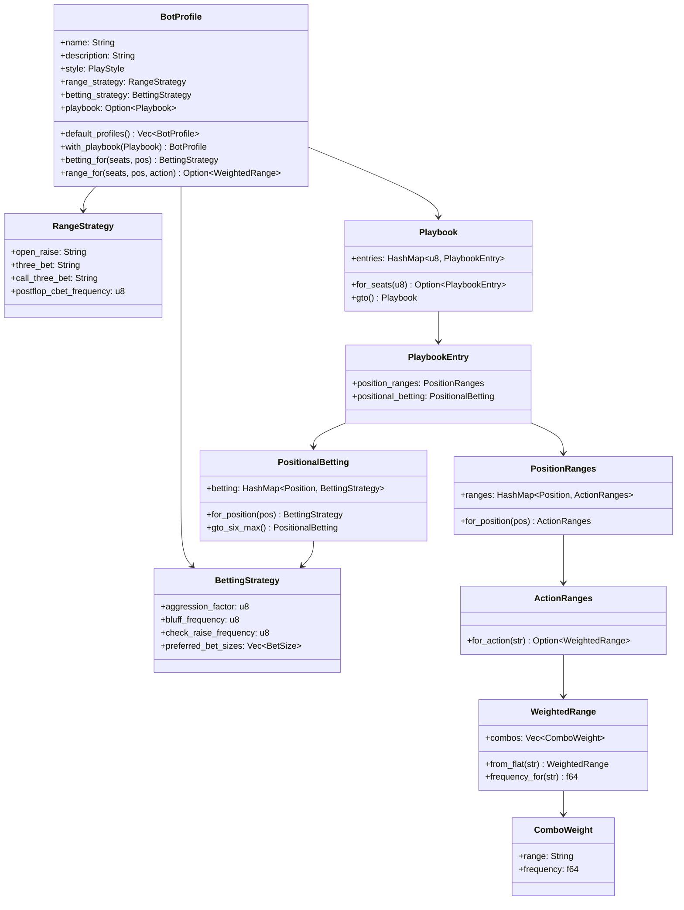
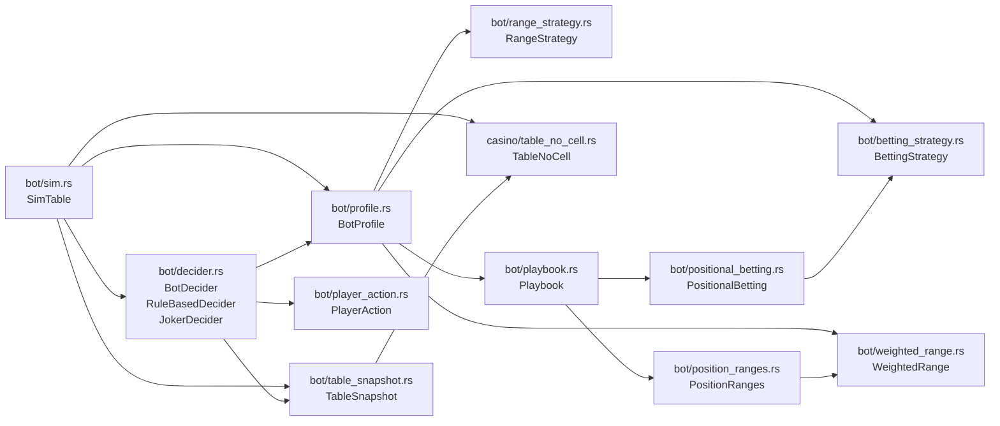
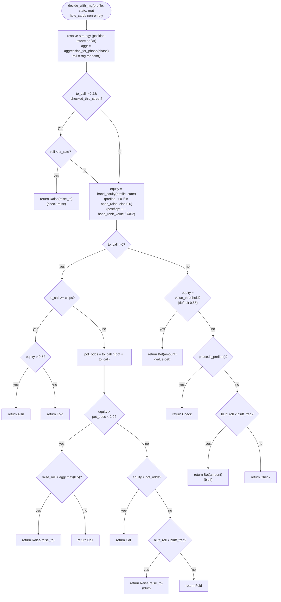
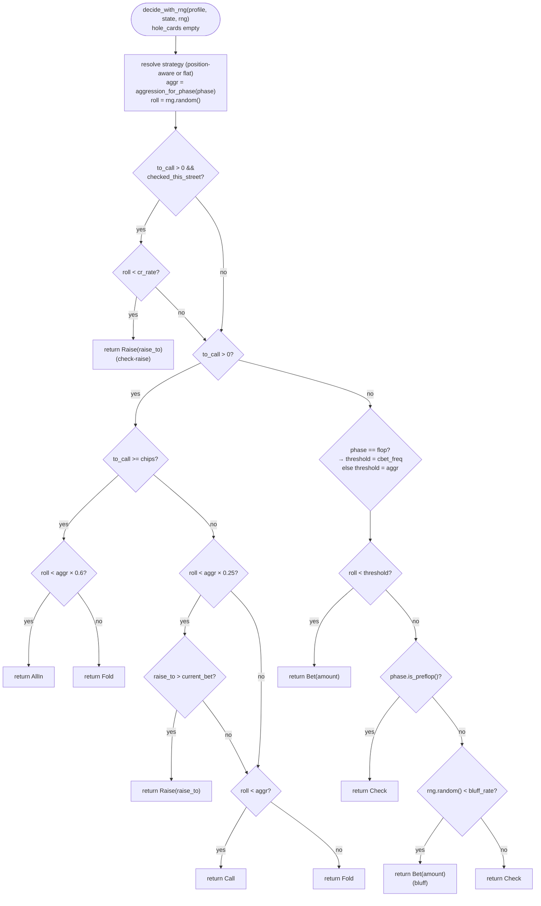
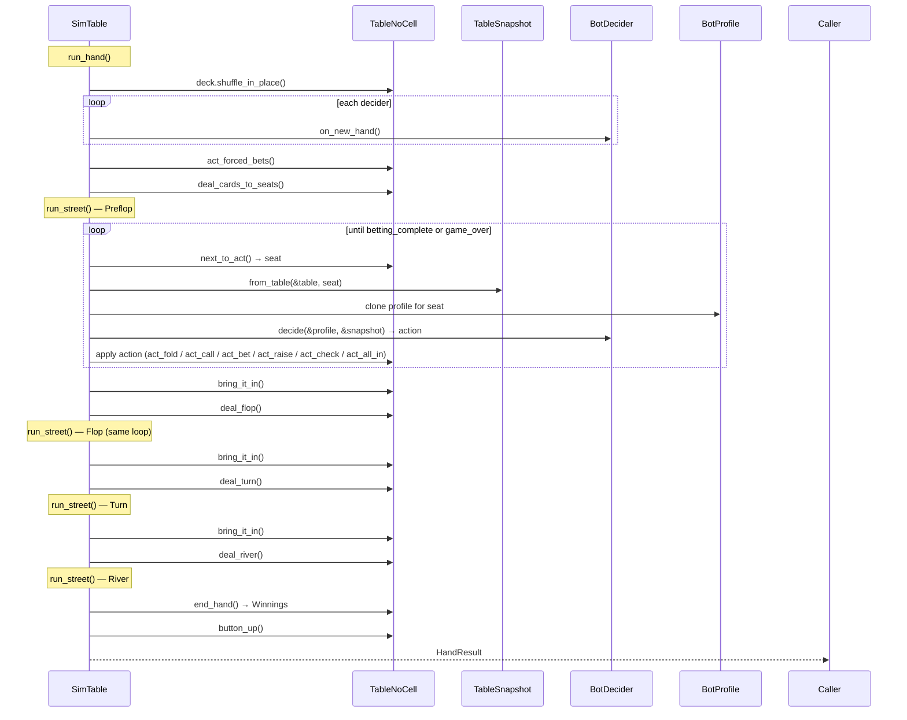

# Bot Module Guide

A comprehensive tutorial, architecture reference, and theory primer for the
`src/bot/` module of pkcore.

---

## Table of Contents

1. [Introduction & Design Philosophy](#1-introduction--design-philosophy)
2. [Quick Start](#2-quick-start)
3. [Architecture Overview](#3-architecture-overview)
4. [Core Types in Depth](#4-core-types-in-depth)
5. [The Decision Algorithm](#5-the-decision-algorithm)
6. [`TableSnapshot` — What the Bot Sees](#6-tablesnapshot--what-the-bot-sees)
7. [Running Simulations](#7-running-simulations)
8. [Implementing a Custom `BotDecider`](#8-implementing-a-custom-botdecider)
9. [Profile Reference](#9-profile-reference)
10. [Poker Theory & Further Reading](#10-poker-theory--further-reading)

---

## 1. Introduction & Design Philosophy

The `src/bot/` module provides a self-contained poker bot personality system.
Given a `BotProfile`, a bot can decide a legal `PlayerAction` at any
decision point on a `TableNoCell` — with no network, no external solver, and
no hand-strength analysis.

### Design Goals

**YAML-serializable profiles.** Every bot personality is a plain data
structure: a name, a style label, a range strategy, and a betting strategy.
Profiles round-trip through YAML without code changes, so operators can tune
bot behavior by editing text files.

**Simulation-first.** `SimTable` can run thousands of hands in a tight loop
and return cumulative statistics. The same `BotDecider` trait and
`TableSnapshot` type will be used by the gRPC agent layer when it ships
(EPIC-19, ROADMAP Phase 4) — the transport changes, the decision logic does not.

**Trait-extensible.** The `BotDecider` trait is deliberately minimal: one
optional hook (`on_new_hand`) and one required method (`decide`). Custom
deciders can integrate any strategy — hand-strength calculators, solvers,
neural networks — without touching the pkcore internals.

**Feature-gated YAML I/O.** Full YAML serialization and file I/O require the
`bot-profiles` feature flag. Core decision logic and in-memory types compile
without it, keeping the default build lean and WASM-compatible.

### Relationship to the Platform

```text
pkcore/src/bot/     ← decision logic, profiles, simulation (this module)
pkdealer/           ← gRPC agent service (future, ROADMAP Phase 4)
pkarena0-web/       ← WASM spectator app, uses BotProfile::default_profiles()
```

The bot module is the single source of truth for bot behavior. All future
agent implementations delegate here.

---

## 2. Quick Start

The simplest possible simulation: two bots, ten hands.

```rust
use pkcore::bot::profile::BotProfile;
use pkcore::bot::sim::SimTable;
use pkcore::casino::game::ForcedBets;
use pkcore::casino::table_no_cell::{PlayerNoCell, SeatNoCell, SeatsNoCell, TableNoCell};

let seats = SeatsNoCell::new(vec![
    SeatNoCell::new(PlayerNoCell::new_with_chips("gto".to_string(), 10_000)),
    SeatNoCell::new(PlayerNoCell::new_with_chips("lag".to_string(), 10_000)),
]);
let table = TableNoCell::nlh_from_seats(seats, ForcedBets::new(50, 100));

let bots = vec![
    (0_u8, BotProfile::gto()),
    (1_u8, BotProfile::loose_aggressive()),
];
let mut sim = SimTable::with_rule_based(table, bots);
let result = sim.run_n_hands(10).unwrap();

println!("Hands played: {}", result.hands_played);
for (seat, net) in &result.net_chips {
    println!("  Seat {seat}: {:+}", net);
}
```

`net_chips` values always sum to zero — chips are conserved across the session.

### Running the example

```bash
cargo run --features bot-profiles --example bot_selfplay
```

---

## 3. Architecture Overview

### Diagram 1 — Type Hierarchy



### Diagram 2 — Module Dependency Graph



---

## 4. Core Types in Depth

### 4.1 `BotProfile`

`BotProfile` (`src/bot/profile.rs`) is the top-level bot personality. It owns
all strategy data and is the argument passed to every `BotDecider::decide` call.

| Field | Type | Purpose |
|-------|------|---------|
| `name` | `String` | Filename stem, e.g. `"gto"` |
| `description` | `String` | Human-readable style description |
| `style` | `PlayStyle` | Archetype label — named enum variant or `Custom(String)` |
| `range_strategy` | `RangeStrategy` | Preflop ranges + c-bet frequency |
| `betting_strategy` | `BettingStrategy` | Aggression, bluff, bet sizing |
| `playbook` | `Option<Playbook>` | Position-aware overrides (optional) |

`PlayStyle` is a proper enum with named variants for all eight reference
archetypes (`TightPassive`, `LooseAggressive`, `Gto`, etc.) and a
`Custom(String)` catch-all for any other label. YAML serialization uses
`snake_case` strings so existing profile files need no changes. Use
`PlayStyle::new("tight_passive")` as a drop-in replacement for the old
`PlayStyle("tight_passive".into())` tuple constructor.

**Named constructors (8 archetypes):**

```rust,ignore
BotProfile::gto()
BotProfile::tight_passive()
BotProfile::loose_aggressive()
BotProfile::tight_aggressive()
BotProfile::loose_passive()
BotProfile::maniac()
BotProfile::abc()
BotProfile::short_stack_ninja()
```

`BotProfile::joker()` is a special placeholder used with `JokerDecider` — its
strategy fields are never consulted at runtime.

**Annotated YAML — `data/bots/gto.yaml`:**

```yaml
name: gto                         # must match filename stem
description: Balanced frequencies informed by GTO solver output; unexploitable at equilibrium.
style: gto                        # PlayStyle label
range_strategy:
  open_raise: QQ+, JJ:0.95, TT:0.8, AKs, AQs, AJs:0.7, AKo, AQo:0.85, KQs:0.9  # mixed-strategy open range
  three_bet: QQ+, AKs             # 3-bet range when facing an open
  call_three_bet: JJ+, AQs+       # call-3-bet range
  postflop_cbet_frequency: 50     # c-bet % on the flop (overrides aggr on that street)
betting_strategy:
  aggression_factor: 50           # core probability knob (0–100)
  bluff_frequency: 33             # postflop bluff rate when value-bet threshold not reached
  check_raise_frequency: 15       # raise rate when checked and facing a bet
  preferred_bet_sizes:            # sampled uniformly for any Bet or Raise
  - 1/3                           # one-third pot
  - 1/1                           # pot
```

### 4.2 `BettingStrategy`

`BettingStrategy` (`src/bot/betting_strategy.rs`) controls the probability
knobs that drive `RuleBasedDecider`. All frequency fields use the `Percentage`
newtype — a validated `u8` in `0..=100` that exposes `.value()` and `.as_f64()`
and compares directly against `u8` literals via `PartialEq<u8>`.

| Field | Type | Meaning |
|-------|------|---------|
| `aggression_factor` | `Percentage` | Primary probability of betting/calling vs checking/folding (fallback path) |
| `bluff_frequency` | `Percentage` | Postflop-only: probability of bluffing when value-bet threshold not reached |
| `check_raise_frequency` | `Percentage` | Probability of check-raising when the bot checked this street |
| `preferred_bet_sizes` | `Vec<BetSize>` | Sampled uniformly for any Bet or Raise action |
| `street_aggression` | `Option<StreetAggression>` | Per-street aggression overrides; `None` fields fall back to `aggression_factor` |
| `value_threshold` | `Option<f64>` | Equity floor for value-betting when unchallenged; defaults to `0.55` |

`aggression_for_phase(phase: GamePhase) -> Percentage` returns the street
override when set, otherwise `aggression_factor`. `effective_value_threshold()`
returns `value_threshold.unwrap_or(0.55)`. `BettingStrategy::new(u8, u8, u8, …)`
still accepts plain `u8` arguments — call sites using the constructor are
unaffected by the `Percentage` change.

**Bet size fractions.** `BetSize` serializes as a human-readable `"N/D"` string
via the private `bet_size_fractions` serde module. Available values:

| YAML string | Fraction of pot | Rust constructor |
|-------------|----------------|-----------------|
| `1/3`       | 33%            | `BetSize::third_pot()` |
| `1/2`       | 50%            | `BetSize::half_pot()` |
| `2/3`       | 67%            | `BetSize::two_thirds_pot()` |
| `1/1`       | 100% (pot-bet) | `BetSize::pot()` |
| `2/1`       | 200% (overbet) | `BetSize::two_pot()` |

**All 8 profiles at a glance:**

| Profile | aggr | bluff | cr | cbet | Bet sizes |
|---------|------|-------|-----|------|-----------|
| `tight_passive` | 25 | 5 | 3 | 30 | `1/2` |
| `loose_passive` | 15 | 3 | 2 | 15 | `1/2` |
| abc | 65 | 0 | 5 | 60 | `2/3` |
| gto | 50 | 33 | 15 | 50 | `1/3`, `1/1` |
| `tight_aggressive` | 70 | 20 | 15 | 65 | `2/3`, `1/1` |
| `loose_aggressive` | 75 | 35 | 20 | 75 | `2/3`, `1/1` |
| maniac | 90 | 55 | 30 | 90 | `1/1`, `2/1` |
| `short_stack_ninja` | 95 | 45 | 40 | 100 | `1/1`, `2/1` |

### 4.3 `RangeStrategy`

`RangeStrategy` (`src/bot/range_strategy.rs`) holds preflop hand selection
strings plus the flop c-bet frequency.

**Hand notation primer:**

| Notation | Meaning | Examples |
|----------|---------|---------|
| `AA` | Specific hand | Pocket aces |
| `QQ+` | Pair this rank or higher | QQ, KK, AA |
| `JJ-TT` | Pair range (inclusive) | JJ, TT |
| `AKs` | Ace-King suited | AK of same suit |
| `AKo` | Ace-King offsuit | AK of different suits |
| `AQ+` | AQ and AK, both suited and offsuit | |
| `AQs+` | AQ suited and AK suited | |
| `87s` | Eight-seven suited | 87 of same suit |
| `54s+` | 54s, 65s, 76s, 87s, 98s, … | Suited connectors 54 and above |
| `KTs+` | KT suited and KJ suited | |
| `22+` | All pocket pairs | 22 through AA |

**All 8 profiles — preflop ranges:**

| Profile | `open_raise` | `three_bet` | `call_three_bet` |
|---------|-----------|-----------|---------------|
| `tight_passive` | `QQ+, AKs` | `AA, KK` | `QQ, AKs` |
| `loose_passive` | `22+, AKs-A2s, KTs+, QTs+, J9s+, T8s+, 98s, ATo+, KTo+` | `QQ+, AKs` | `TT+, AJs+` |
| abc | `QQ+, AKs, AKo` | `AA, KK` | `QQ, AKs` |
| gto | `QQ+, JJ:0.95, TT:0.8, AKs, AQs, AJs:0.7, AKo, AQo:0.85, KQs:0.9` | `QQ+, AKs` | `JJ+, AQs+` |
| `tight_aggressive` | `JJ+, AQs+, KQs, AKo` | `QQ+, AKs` | `JJ+, AQs+` |
| `loose_aggressive` | `22+, AT+, 54s+` | `QQ+, AKs, AQs` | `TT+, AQs+` |
| maniac | `22+, AT+, 54s+` | `TT+, AQs, AQo+, KQs` | `88+, ATs+` |
| `short_stack_ninja` | `77+, ATs+, KQs, AJo+, KQo` | `AA, KK, QQ` | *(empty — push or fold)* |

### 4.4 Playbook & Position-Aware Dispatch

A `Playbook` (`src/bot/playbook.rs`) stores a `HashMap<u8, PlaybookEntry>` —
keyed by seat count — so a bot can play differently at a 6-max table vs. a
9-max table.

A `PlaybookEntry` holds two components:
- `PositionRanges` — preflop ranges keyed by `Position` and action name
- `PositionalBetting` — a `BettingStrategy` per position, with a flat fallback

#### Diagram 3 — Playbook Resolution

```mermaid
flowchart LR
    call["profile.betting_for(seats, pos)"]
    pb_check{"playbook\npresent?"}
    for_seats["Playbook::for_seats(seats)"]
    entry_check{"entry\nfound?"}
    pos_bet["PositionalBetting::for_position(pos)"]
    pos_check{"position\nmapped?"}
    pos_strategy["per-position BettingStrategy"]
    flat_default["profile.betting_strategy (flat)"]

    call --> pb_check
    pb_check -- "None" --> flat_default
    pb_check -- "Some" --> for_seats
    for_seats --> entry_check
    entry_check -- "None" --> flat_default
    entry_check -- "Some PlaybookEntry" --> pos_bet
    pos_bet --> pos_check
    pos_check -- "not mapped" --> flat_default
    pos_check -- "mapped" --> pos_strategy
```

**Why position matters.** In NLH, acting last (in position) gives an
information advantage: you see all opponents' actions before deciding. This is
worth a measurable aggression premium. The GTO 6-max positional aggression
values reflect this:

| Position | Role | GTO 6-max `aggr` |
|----------|------|-----------------|
| LJ | Lojack (early) | 45 |
| HJ | Hijack | 48 |
| CO | Cutoff | 52 |
| BTN | Button (latest position) | 60 |
| SB | Small blind (acts 1st postflop) | 50 |
| BB | Big blind (acts 2nd postflop) | 50 |

The 15-point swing from LJ (45) to BTN (60) reflects real-world solver output:
the button can profitably open and continue with a significantly wider range
because positional advantage compensates for marginal hand strength.

### 4.5 `WeightedRange` & Mixed Strategies

`WeightedRange` (`src/bot/weighted_range.rs`) represents a mixed strategy —
a list of `ComboWeight` entries where each entry is a range token plus a
`frequency` in `[0.0, 1.0]`.

```rust,ignore
// Pure strategy — always raise AA, always raise KK
let wr = WeightedRange::from_flat("AA, KK");   // both at 1.0

// Mixed strategy — raise AA always, raise KK 75% of the time
let mut wr = WeightedRange::new();
wr.push("AA", 1.0).push("KK", 0.75);
```

**What mixed frequencies mean in game theory.** A player is indifferent
between two actions when the expected value of each is equal. GTO solvers
express this indifference as a mixed strategy: play action A with probability
p and action B with probability 1−p, where p makes the opponent indifferent.
A frequency of 0.75 for KK means: "a solver determined that raising KK 75% of
the time and calling 25% of the time is the unexploitable equilibrium at this
node." Pure strategies (0 or 1) are exploitable by observant opponents.

**EPIC-25 (complete).** Range strings support inline frequency suffixes —
`"AA:1.0, KK:0.75, QQ:0.5"` — so playbook YAML files can directly encode
solver-generated mixed strategies without writing Rust code.

---

## 5. The Decision Algorithm

### 5.1 Overview

`BotDecider` (`src/bot/decider.rs`) is the trait every decision-making strategy
implements:

```rust,ignore
pub trait BotDecider: Send + Sync {
    fn on_new_hand(&self) {}
    fn decide(&self, profile: &BotProfile, state: &TableSnapshot) -> PlayerAction;
}
```

Two implementations ship in pkcore:

- **`RuleBasedDecider`** — a zero-sized unit struct. Its `decide` method
  delegates directly to `decide_with_rng(profile, state, &mut rand::rng())`.
  The `pub(crate) decide_with_rng<R: Rng>` helper is separated so that tests
  can inject a `SmallRng::seed_from_u64(seed)` for deterministic results
  without any mocking or trait objects.

- **`JokerDecider`** — wraps a `Mutex<BotProfile>` that is randomly replaced
  at the start of each hand via `on_new_hand()`. In-hand decisions delegate
  to `RuleBasedDecider`. The joker's profile argument to `decide` is ignored;
  the randomly-selected active profile drives the decision.

### 5.2 Complete Decision Flowchart

`decide_with_rng` operates in two modes depending on whether hole cards are
available. When `hole_cards` is non-empty, an equity proxy drives the decision
(equity path). When cards are absent — e.g. in tests that do not inject cards,
or in future gRPC scenarios where cards have not yet been dealt — the original
aggression-factor random-roll path is used as a fallback.

#### Diagram 4a — Equity Path (hole cards present)



#### Diagram 4b — Fallback Path (no hole cards)



### 5.3 The Math

#### Equity path — when hole cards are present

**Preflop equity** is a probabilistic proxy driven by `RangeStrategy::open_raise_frequency`.
The method returns the combo's `:f` weight from the range string (`1.0` for
hands without a suffix, `0.0` for absent hands). A random roll is then compared
against this weight: if `roll < freq`, equity is `1.0`; otherwise `0.0`. This
implements mixed strategies — a JJ at `0.95` folds preflop 5% of the time.
Range strings are case-insensitive; `+` notation is expanded via `Twos::from(Combos)`
before the lookup.

**Postflop equity** is derived from the best 5-of-N hand formed by combining
hole cards and board, evaluated by `Five`/`Six`/`Seven::hand_rank_value()` and
normalized: `equity = 1.0 − hrv / 7462.0`. A royal flush → `1.0`; 7-high
nothing → `0.0`.

**Decision bands when facing a bet (equity path):**

| Condition | Outcome |
|-----------|---------|
| `to_call ≥ chips` and `equity > 0.5` | `AllIn` |
| `to_call ≥ chips` and `equity ≤ 0.5` | `Fold` |
| `equity > pot_odds × 2.0` and `raise_roll < aggr.max(0.5)` | `Raise` |
| `equity > pot_odds × 2.0` (`raise_roll` failed) | `Call` |
| `equity > pot_odds` | `Call` |
| `equity ≤ pot_odds` and `bluff_roll < bluff_freq` | `Raise` (bluff) |
| `equity ≤ pot_odds` | `Fold` |

where `pot_odds = to_call / (pot + to_call)`.

**Why a probabilistic raise gate?** When two bots both hold in-range preflop
hands (`equity = 1.0`), a deterministic raise creates an unconditional raise
war — each bot raises every action until one is all-in, collapsing chip stacks
in a few hands. The gate `raise_roll < aggr.max(0.5)` introduces variance:
with GTO's 50% gate, two bots have only a 25% chance of both raising on the
next action, 6.25% on the one after that — geometrically decaying escalation.
See `docs/DEFECT_bot-escalation.md`.

**Decision when no bet is outstanding (equity path):**

| Condition | Outcome |
|-----------|---------|
| `equity > value_threshold` (default `0.55`) | `Bet` (value) |
| `equity ≤ threshold` and postflop and `bluff_roll < bluff_freq` | `Bet` (bluff) |
| `equity ≤ threshold` and preflop | `Check` |
| `equity ≤ threshold` and postflop | `Check` |

#### Fallback path — aggression-factor bands (no hole cards)

For a given `aggression_factor` value `a`, when facing a bet (normal stack):

| Outcome | Roll range | GTO (a=50) | TAG (a=70) | Maniac (a=90) |
|---------|-----------|-----------|-----------|--------------|
| Raise | `[0, a×0.25)` | 12.5% | 17.5% | 22.5% |
| Call | `[a×0.25, a)` | 37.5% | 52.5% | 67.5% |
| Fold | `[a, 1.0)` | 50.0% | 30.0% | 10.0% |

**Why 0.25 for raises?** A player who raises about one-quarter of their
"call range" mirrors real-world VPIP/PFR stats for solid winning regulars —
PFR is roughly one-quarter of VPIP. It's a rough approximation, not a solver
output; `StreetAggression` allows per-street tuning.

Short-stack territory (`to_call ≥ chips`):

| Outcome | Roll range | GTO (a=50) | TAG (a=70) | Maniac (a=90) |
|---------|-----------|-----------|-----------|--------------|
| `AllIn` | `[0, a×0.6)` | 30.0% | 42.0% | 54.0% |
| Fold | `[a×0.6, 1.0)` | 70.0% | 58.0% | 46.0% |

When no bet is outstanding (fallback path):

| Phase | Threshold | Outcome if roll ≥ threshold |
|-------|-----------|---------------------------|
| Flop | `cbet_freq / 100` | Second roll vs. `bluff_rate` |
| Turn / River | `aggr / 100` | Second roll vs. `bluff_rate` |
| Preflop | `aggr / 100` | Check (no bluff on preflop) |

**Independence of the bluff roll.** The bluff path draws a *second*
independent `roll_bluff` after the first roll fails the value-bet threshold.
Without the second roll, P(bluff) would be `(1 − threshold) × bluff_rate`,
coupling the bluff rate to the aggression setting. With a fresh roll,
P(bluff) = `bluff_rate` exactly.

#### Bet sizing arithmetic

When the bot decides to bet (no outstanding bet):

```text
amount = max(pot × n/d, big_blind)  capped at my_chips
```

When raising (responding to a bet):

```text
raise_to = current_bet + pot × n/d
         max(current_bet + min_raise)   // enforce minimum raise
         min(my_chips)                  // cap at stack
```

Example: `pot=300`, sizing=`2/3`, `current_bet=100`, `min_raise=100`:

```text
raise_to = 100 + floor(300 × 2 / 3)
         = 100 + 200
         = 300
max(100 + 100 = 200, 300) = 300   ← minimum raise doesn't bind
min(300, my_chips)
```

Example with small pot: `pot=60`, sizing=`2/3`, `current_bet=100`, `min_raise=100`:

```text
raise_to = 100 + floor(60 × 2 / 3)
         = 100 + 40
         = 140
max(100 + 100 = 200, 140) = 200   ← minimum raise binds here
```

The minimum-raise enforcement (`current_bet + min_raise`) prevents illegal
sub-minimum raises on small pots.

### 5.4 C-bet, Bluff, and Check-Raise Mechanics

#### Continuation bet (c-bet)

A c-bet is a bet on the flop by the preflop aggressor — "continuing the story"
of preflop strength. The `postflop_cbet_frequency` field models this at the
statistical level: on any flop where `to_call == 0`, the bot bets with
probability `cbet_freq / 100.0` rather than `aggr / 100.0`.

Current implementation note: the decider does not currently track whether
this bot actually raised preflop. `postflop_cbet_frequency` fires for any
flop bet, not just those after a preflop raise. In practice, since both players
typically either raised or called a raise preflop, the approximation is
acceptable for simulation purposes.

#### Bluff

Bluffs are postflop only (flop, turn, or river — not preflop). After the
value-bet threshold fails, a second independent random roll is compared to
`bluff_rate`. If it passes, the bot bets the same sizing it would for a value
bet. From the opponent's perspective, the bot's betting range includes both
value and bluff hands — making it harder to exploit by always folding or
always calling.

#### Check-raise

A check-raise requires two conditions: `checked_this_street == true` (the bot
checked earlier in this round) and `to_call > 0` (someone has bet since). If
`roll < cr_rate`, the bot raises. This models a classic deceptive line: check
to induce a bet, then raise to extract more value (or bluff with a strong
representation).

`checked_this_street` is populated by scanning the event log from the most
recent street-boundary marker (`ForcedBetBigBlind`, `DealtFlop`, `DealtTurn`,
or `DealtRiver`) forward for a `TableAction::Check(seat)` event matching the
current player's seat. See Section 6 for details.

---

## 6. `TableSnapshot` — What the Bot Sees

`TableSnapshot` (`src/bot/table_snapshot.rs`) is a read-only, owned view of the
table built for one seat's perspective. All fields are copied values — no
lifetime ties it to the live table.

| Field | Type | Purpose |
|-------|------|---------|
| `seat` | `u8` | The seat this snapshot was built for |
| `phase` | `GamePhase` | Preflop, flop, turn, river, or showdown |
| `board` | `Cards` | Community cards (empty before flop) |
| `hole_cards` | `Cards` | This player's own cards (opponents' hidden) |
| `pot` | `usize` | Total pot = swept pot + all live bets this street |
| `to_call` | `usize` | Chips needed to call; 0 = may check |
| `current_bet` | `usize` | Highest bet on the current street |
| `min_raise` | `usize` | Minimum legal raise increment |
| `my_chips` | `usize` | This player's remaining stack |
| `stacks` | `Vec<SeatInfo>` | All seats: seat index, name, chips, bet, `is_active` |
| `big_blind` | `usize` | BB amount — baseline sizing unit |
| `checked_this_street` | `bool` | True if this player checked earlier this street |
| `dealer_button` | `Option<u8>` | Seat index of the dealer button; `None` if not set |
| `seat_count` | `u8` | Total number of seats at the table — used by `Playbook::for_seats` |
| `logical_seat` | `Option<u8>` | This player's logical seat index within a smaller active-player range; used by `Position::from_seat` for position-aware dispatch |

**Visibility rule.** Opponents' `hole_cards` are never included in
`stacks` — `SeatInfo` only exposes chip counts and bet amounts. Only
`TableSnapshot.hole_cards` reveals cards, and those are only the viewing
player's own.

**Pot computation.**

```rust,ignore
let committed: usize = table.seats.0.iter().map(|s| s.player.bet).sum();
let pot = table.pot + committed;
```

`table.pot` holds chips swept in from previous streets; `committed` is the
sum of all live bets on the current street. Adding them gives the total chips
at stake, which is what the bot needs for pot-fraction sizing decisions.

**`checked_this_street` — how the event log scan works:**

```text
pseudocode:

street_start = last index of (ForcedBetBigBlind | DealtFlop | DealtTurn | DealtRiver) + 1
             = 0 if no such event exists

checked_this_street = any event in event_log[street_start..] is Check(this_seat)
```

Using `rposition` (find-last) for the boundary marker handles the case where
`event_log` is cumulative across multiple hands in a simulation session — the
scan always anchors to the current hand's current street.

#### Diagram 5 — `SimTable` Hand Sequence



---

## 7. Running Simulations

### `SimTable` constructors

```rust,ignore
// All seats use RuleBasedDecider — most common
SimTable::with_rule_based(table, vec![(seat_u8, profile), ...])

// Mix decider types — e.g. custom decider in seat 0
SimTable::new(table, vec![(seat_u8, profile, Box::new(decider)), ...])
```

### `ActionCounts`

Counts every action type for each seat across one or more hands.

```rust
pub struct ActionCounts {
    pub folds:   usize,
    pub checks:  usize,
    pub calls:   usize,
    pub bets:    usize,    // opening bets
    pub raises:  usize,
    pub all_ins: usize,
}
```

`merge(&other)` accumulates counts in place — useful for aggregating
across multiple runs.

**Detecting exploitable bots.** Run 1000 hands and compute ratios from
`actions_taken`:

```rust,ignore
let seat0 = result.actions_taken.get(&0).unwrap();
let aggr_freq = (seat0.bets + seat0.raises) as f64 / seat0.total() as f64;
// Compare against expected BetSize.aggression_factor / 100.0 ± tolerance
```

A bot whose `aggr_freq` diverges significantly from `aggression_factor / 100.0`
has an implementation bug in its decision path.

### `HandResult` and `SimResult`

```rust,ignore
pub struct HandResult {
    pub winnings: Winnings,                  // pot distribution for this hand
    pub actions: HashMap<u8, ActionCounts>,  // per-seat counts this hand
}

pub struct SimResult {
    pub hands_played: usize,
    pub net_chips: HashMap<u8, i64>,               // + profit, − loss
    pub actions_taken: HashMap<u8, ActionCounts>,  // cumulative
}
```

**Chip conservation invariant.** `result.net_chips.values().sum::<i64>() == 0`.
The total chips in play never change — every pot awarded to a winner is taken
from losers. This invariant is tested in `test_run_n_hands_net_chips_sum_to_zero`.

### Example: 100 hands, print winner

```rust,ignore
let mut sim = SimTable::with_rule_based(table, bots);
let result = sim.run_n_hands(100).unwrap();

let winner = result.net_chips
    .iter()
    .max_by_key(|(_, net)| *net)
    .map(|(seat, net)| format!("Seat {seat}: {:+} chips", net))
    .unwrap_or("no winner".to_string());

println!("After {} hands: {}", result.hands_played, winner);
```

---

## 8. Implementing a Custom `BotDecider`

`BotDecider` is object-safe and `Send + Sync` — you can store it as
`Box<dyn BotDecider>` in a `SimTable`.

### Minimal implementation

```rust
use pkcore::bot::decider::BotDecider;
use pkcore::bot::player_action::PlayerAction;
use pkcore::bot::profile::BotProfile;
use pkcore::bot::table_snapshot::TableSnapshot;

pub struct AlwaysCheckDecider;

impl BotDecider for AlwaysCheckDecider {
    fn decide(&self, _profile: &BotProfile, _state: &TableSnapshot) -> PlayerAction {
        PlayerAction::Check
    }
}
```

### `on_new_hand()` use cases

Override `on_new_hand()` for any per-hand reset:
- Shuffle a per-hand strategy
- Reset a "have I 3-bet this hand?" flag
- Pick a random profile (as `JokerDecider` does)

### `JokerDecider` as a reference implementation

`JokerDecider` stores a `Mutex<BotProfile>` — the lock is necessary because
`on_new_hand()` takes `&self` (shared reference), and `decide()` may run
concurrently with other seats.

```rust,ignore
pub struct JokerDecider {
    active: Mutex<BotProfile>,
}

impl BotDecider for JokerDecider {
    fn on_new_hand(&self) {
        // Replace active profile from the standard set
        let profiles = BotProfile::default_profiles();
        let idx = rand::rng().random_range(0..profiles.len());
        if let Ok(mut guard) = self.active.lock() {
            *guard = profiles[idx].clone();
        }
    }

    fn decide(&self, _profile: &BotProfile, state: &TableSnapshot) -> PlayerAction {
        // Note: ignores the passed profile, uses internal active profile
        let active = self.active.lock()
            .map_or_else(|e| e.into_inner().clone(), |g| g.clone());
        RuleBasedDecider.decide(&active, state)
    }
}
```

### Testing with seeded RNG

The `decide_with_rng` helper makes deterministic testing straightforward:

```rust,ignore
use rand::SeedableRng;
use rand::rngs::SmallRng;
use pkcore::bot::decider::RuleBasedDecider;

let mut rng = SmallRng::seed_from_u64(42);
let action = RuleBasedDecider::decide_with_rng(&profile, &snapshot, &mut rng);
```

For statistical tests (intermediate probability values), run `N=1_000` iterations
with a fixed seed and assert within ±25 percentage points of the expected
frequency. This is wide enough to be non-flaky while still catching the case
where a field has no effect at all.

---

## 9. Profile Reference

Full comparison of all 8 reference profiles:

| Profile | style | aggr | bluff | cr | cbet | Bet sizes | `open_raise` |
|---------|-------|------|-------|-----|------|-----------|-----------|
| `tight_passive` | Nit | 25 | 5 | 3 | 30 | `1/2` | `QQ+, AKs` |
| `loose_passive` | Calling station | 15 | 3 | 2 | 15 | `1/2` | `22+, AKs-A2s, KTs+, …` |
| abc | By-the-book | 65 | 0 | 5 | 60 | `2/3` | `QQ+, AKs, AKo` |
| gto | Balanced | 50 | 33 | 15 | 50 | `1/3`, `1/1` | `TT+, AQ+, KQs` |
| `tight_aggressive` | TAG | 70 | 20 | 15 | 65 | `2/3`, `1/1` | `JJ+, AQs+, KQs, AKo` |
| `loose_aggressive` | LAG | 75 | 35 | 20 | 75 | `2/3`, `1/1` | `22+, AT+, 54s+` |
| maniac | Aggro | 90 | 55 | 30 | 90 | `1/1`, `2/1` | `22+, AT+, 54s+` |
| `short_stack_ninja` | SSN | 95 | 45 | 40 | 100 | `1/1`, `2/1` | `77+, ATs+, KQs, AJo+, KQo` |

**Style descriptions:**

- **`tight_passive`** — Plays premium hands only; rarely bluffs. Predictable and
  safe against inexperienced opponents, but exploitable by anyone who notices
  the tight range and folds to every bet.
- **`loose_passive`** — The calling station: wide range, passive action. Loses
  chips steadily by calling too much; hard to bluff off hands.
- **abc** — Strong hands, standard sizing, zero bluffing. Easy to read but
  profitable against very loose players.
- **gto** — Balanced frequencies approximating solver output. Unexploitable in
  principle; not maximally exploitative against weak opponents.
- **`tight_aggressive`** — The baseline winning style for most formats. Strong
  hand selection + maximum aggression = good risk-adjusted expected value.
- **`loose_aggressive`** — Wide ranges + high aggression = puts maximum pressure.
  High variance; great against passive opponents.
- **maniac** — Extreme aggression, large overbets. Effective against timid
  players; catastrophic against trappy, patient opponents.
- **`short_stack_ninja`** — Push-or-fold logic. Not meaningful at deep stack
  tables but dominating in short-stack spots.

---

## 10. Poker Theory & Further Reading

### Game Theory Foundations

**Nash equilibrium.** A strategy profile where no player can improve their
expected value by unilaterally changing strategy. A GTO strategy is a Nash
equilibrium strategy — playing it guarantees you cannot lose in the long run
against any opponent. The trade-off: it is not maximally exploitative.

**Exploitative vs. balanced.** Against a bot that folds to every continuation
bet, the maximally exploitative strategy is to c-bet 100%. Against a random
opponent, a balanced strategy (GTO) is safer. The `aggression_factor` field is
a knob between these extremes.

**Pot odds.** Before calling a bet, compute the break-even equity:

```text
break_even = to_call / (pot + to_call)
```

Example: pot=300, `to_call=100`:
```text
break_even = 100 / (300 + 100) = 100 / 400 = 25%
```

If your hand wins more than 25% of the time at showdown, calling is
mathematically correct. `RuleBasedDecider` computes an equity proxy when hole
cards are present — binary preflop (1.0/0.0 based on `open_raise` range membership)
or normalized hand-rank-value postflop — and compares it against pot odds directly.
When hole cards are absent, `aggression_factor` serves as a coarse substitute.

**Alpha (bluff-catching threshold).** The fraction of the time you need to be
winning when you call a bet on the river to break even:

```text
alpha = bet_size / (pot + 2 × bet_size)
```

Example: pot=200, bet=100:
```text
alpha = 100 / (200 + 200) = 100 / 400 = 25%
```

At alpha, you are indifferent between calling and folding. Bluffing at exactly
alpha frequency makes the opponent indifferent between calling and folding
their bluff-catchers — this is the core of balanced GTO river play.

**Why `aggression_factor` matters.** Each percentage point of aggression
corresponds directly to a shift in fold-vs-call ratio against that bot. A
player facing a GTO bot (aggr=50) who calls 37.5% and folds 50% is exploitable:
they fold too often. Profiling bots by their action counts after 1000 hands is
the simplest way to find the exploit.

### Recommended Reading

**Foundational texts:**

- *The Mathematics of Poker* — Bill Chen & Jerrod Ankenman\
  Rigorous mathematical treatment of poker game theory. Chapters on optimal
  bluffing frequencies and equilibrium strategies are directly applicable to
  the `bluff_frequency` and `aggression_factor` fields.

- *Modern Poker Theory* — Michael Acevedo\
  GTO-based NLH strategy; range construction methodology matches the notation
  used in `RangeStrategy` (`QQ+`, `AKs`, `54s+`).

- *Applications of No-Limit Hold'em* — Matthew Janda\
  Frequency-based play; the aggression frequency and fold equity concepts
  underpin the `RuleBasedDecider` probability model.

- *Poker's 1%* — Ed Miller\
  Aggression frequency in practice — accessible treatment of when and how
  often to bet for value vs. bluff.

**Academic / research:**

- Bowling et al., "Heads-up Limit Hold'em Poker is Solved," *Science* 348,
  2015. Demonstrated that a Nash equilibrium strategy for HULHE was computable
  and effectively unbeatable. The first proof that a meaningful form of poker
  was a solved game.

- Brown & Sandholm, "Superhuman AI for multiplayer poker" (Pluribus), *Science*
  2019. Extended equilibrium play to 6-player NLH; the first superhuman
  multi-player poker AI.

- Moravčík et al., "`DeepStack`: Expert-Level Artificial Intelligence in
  No-Limit Poker," *Science* 2017. Neural network approach for real-time
  hand re-solving — closer in spirit to the EPIC-25 hand-strength decisions
  backlog item than to the current rule-based approach.

**Solvers and tools:**

- GTO+ / `PioSOLVER` / Monker Solver — commercial tree solvers that generate
  the per-node mixed-strategy frequencies that would populate a fully solved
  `WeightedRange` in EPIC-25.
- gtowizard.com — web-based GTO training with prebuilt solutions.
- `PokerSnowie` — neural-network-based strategy tool; good reference for what
  balanced frequencies look like in practice.

---

*Guide current as of pkcore `profiles` branch, April 2026 (v0.0.49).*
*All EPIC-19/25 bot features are complete. See `ROADMAP.md` for Phase 4 (gRPC agent service) plans.*
