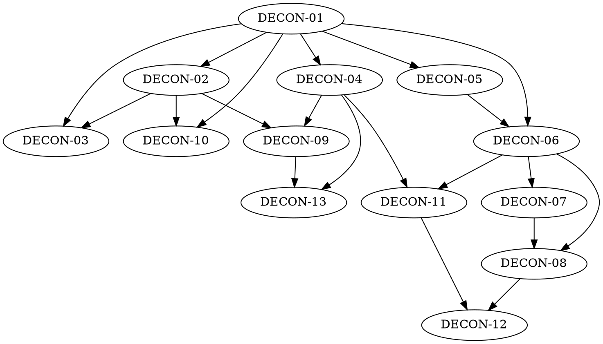

# pkcore Regeneration Pack — MANIFEST

**Source:** `https://github.com/ImperialBower/pkcore` at commit `d9b8368` (2026-07-28)
**Generated by:** the /deconstruct skill
**Contract:** an implementation in any language that satisfies every DECON
epic below and reproduces all golden vectors is a functional regeneration of
the source. Everything else — language, layout, internal design — is the
implementer's choice.

## Goal

pkcore is a **poker domain kernel**: a pure, delivery-agnostic body of poker
knowledge with no transport, no user interface, and no persistence in its
core. It knows what a card is, what beats what, how five real poker variants
deal and bet, how chips move into and out of pots, how to measure a hand's
equity, and how to reason about ranges and strategy. It is explicitly *not* a
product — the source's own framing is that the domain is the seed and any
product is the flower.

A regeneration must be able to: name and order every card; rank any poker
hand, high or low; deal and bet out a full hand of No-Limit Hold'em,
Fixed-Limit Hold'em, Pot-Limit Omaha, Seven-Card Stud Hi, or Razz; settle
the pot correctly including layered side pots; record that hand losslessly
and replay it to an identical result; compute equity exactly or by sampling;
and drive seats with configurable, deterministic automated agents.

## Epics & build order

| # | Epic | Scope (one line) | Depends on |
|---|---|---|---|
| 01 | `DECON-01_Card_Vocabulary.md` | The 52-card French deck: ranks, suits, canonical order, text forms, card collections and set algebra | — |
| 02 | `DECON-02_High_Hand_Ranking.md` | Ranking any 5-card hand into a total order over 7,462 distinct hands; best-five-of-N; the Omaha 2-from-hand/3-from-board rule | 01 |
| 03 | `DECON-03_Lowball_Ranking.md` | Ace-to-five lowball (Razz) ranking and the eight-or-better qualifier | 01, 02 |
| 04 | `DECON-04_Range_Notation.md` | Hand-class notation (`AKs`, `QQ+`, `AJo`), range sets, weighted ranges, and expansion to concrete holdings | 01 |
| 05 | `DECON-05_Variants_And_Betting.md` | The five variants as street tables plus betting structures: no-limit, pot-limit, fixed-limit sizing and caps | 01 |
| 06 | `DECON-06_Table_Engine.md` | Seating, button, forced bets, dealing order, legal actions, action ordering, street advance, showdown trigger | 01, 05 |
| 07 | `DECON-07_Pot_Accounting.md` | Chip conservation, layered side pots, uncalled-bet return, tie splitting and odd chips | 06 |
| 08 | `DECON-08_Hand_History.md` | The lossless hand record and deterministic replay to identical final stacks | 06, 07 |
| 09 | `DECON-09_Equity_And_Odds.md` | Exact enumeration vs. seeded sampling; win/tie/equity shares; pot odds, expected value, outs | 02, 04 |
| 10 | `DECON-10_Suit_Isomorphism.md` | Suit-rotation equivalence: reducing the matchup universe to a distinct set | 01, 02 |
| 11 | `DECON-11_Agent_Model.md` | Automated seat occupants: play styles, positional ranges, betting strategy, bounded information, seeded determinism | 04, 06 |
| 12 | `DECON-12_Player_Statistics.md` | Behavioural statistics from hand records, confidence banding, and counter-strategy adjustment | 08, 11 |
| 13 | `DECON-13_Equilibrium_Solving.md` | Counterfactual-regret equilibrium solving, exploitability, and the Kuhn-poker analytic oracle | 04, 09 |



## Perspectives taxonomy

### Actor perspectives

| Perspective | Rating | Evidence | Boundary invariant |
|---|---|---|---|
| **God-mode** | **Absent** | The card vocabulary, the rank ladder, and the set of playable variants are all fixed by the library. A consumer selects among known variants; it cannot add one, change what beats what, or deal from a deck that is not the 52-card French deck. | Only the library decides what a card, a ranking, and a poker variant *are*. |
| **Administrative** | **Partial** | Real lifecycle and configuration: create and destroy tables, seat and remove players, set and raise stakes, bust players out, tune agent behaviour from data files, and choose where records are kept (the statistics store is a genuine pluggable seam). Gaps: no multi-table operation for the primary engine, no bankroll ledger or buy-in/cash-out record, and only one of the three persistable artifacts has a storage abstraction. | An operator can seat, stake, start, settle, and record — without changing the rules of the game being dealt. |
| **User/client** | **Partial** | The read path is bounded: a per-identity projection reveals only the requesting seat's own hole cards, and carries no deck at all, so no viewer can see an undealt card. The state path is not bounded: table state including the deck is directly reachable and writable, and the alternate engine permits deck mutation through a shared reference. | A client sees only what its own identity is entitled to see — but nothing yet stops it from rewriting the table. Fair play is a property of how the API is called, not of what it permits. |
| **Observer/operator** | **Partial** | Rich retrospective record: an append-only in-hand event log with side-effect-free readers and natural-language narration, plus a full structured hand history derivable from that log alone. No live stream: there is no subscription, cursor, or progress callback, and no telemetry instrumentation of any kind in the core. Long-running analysis is opaque and uncancellable. The audit log is also erasable through a shared reference, so records are evidence but not tamper-evident evidence. | Anything that already happened can be reconstructed and re-examined without disturbing it; nothing can watch a hand as it is played except the code driving it. |
| **Agent** *(repo-specific)* | **Full** | A published decision contract any third party can implement, with per-hand lifecycle hooks and an explicitly seeded variant so simulations reproduce exactly. Agents receive a snapshot of the table from their own seat's point of view rather than the live table. Behaviour is data, not code: nine archetypes plus per-variant profiles, all file-loadable. | An agent decides only what to do with the cards it holds; it can neither see nor change anything its seat would not know. |
| **Trainer/researcher** *(repo-specific)* | **Full** | Equilibrium solving with measurable exploitability, evolutionary profile training, self-play at scale, an in-tree toy game with a known analytic solution as a correctness oracle, and reproducibility guarantees at every layer (seeded sampling, seeded agents, replayable histories). | A researcher can rerun any experiment and get the same answer, and can measure a strategy against a known-optimal reference without altering either. |
| **Spectator** *(repo-specific)* | **Partial** | The redaction primitive exists — a view with no viewer identity reveals no hole cards at all — but there is no delivery mechanism; spectating is a planned concern of a downstream repository. | A spectator learns everything about a hand except what the players are holding. |
| **Trustless/cryptographic peer** *(repo-specific)* | **Absent** | Verifiable shuffling and commitment protocols are written up as research, with no implementation. Structurally unreachable while any holder of a shared table reference can rewrite the deck. | *(none — recorded as a designed absence)* |

### Quality lenses

Lens findings are **informative by default**: they describe the original and
do not bind a rebuild. See **SD-08**.

| Lens | Rating | Characteristic (observable terms) |
|---|---|---|
| **Performant** | **Partial** | Ranking a five-card hand costs the same regardless of which hand it is — a bounded, allocation-free computation over embedded tables. Ranking seven cards costs exactly twenty-one five-card rankings; an Omaha hand costs exactly sixty. Equity is answered exactly whenever exactness is affordable and reproducibly when it is not, and the exactness threshold is an explicit, tunable policy rather than a hidden heuristic. Heads-up preflop equity is answered from a precomputed table with no search at all. Countervailing: the crate carries a ~15.8 MB precomputed table into every consumer unconditionally, the table layer allocates freely in contrast to the evaluation layer, and the strongest performance claims are unmeasured — the only benchmarks cover two preflop cases, with no benchmark of the evaluator, equity engine, shuffle, or solver, and no regression gate. |
| **Flexibility** | **Full** *(layering)* / **Partial** *(reach)* | The rules of poker are available anywhere the language runs; only the conveniences — a database, a colour terminal, a serialization format — require a host that offers them, and asking for one you do not have is a build-time choice rather than a runtime failure. Eleven independent optional capabilities, a bare core that is separately tested, and a machine-enforced gate asserting the bare core's dependency graph stays clean. Browser execution is verified by build check. Countervailing: no bare-metal/embedded capability, browser support is checked but never *executed* under test, non-browser sandboxed targets are unsupported, and the large embedded table cannot be switched off. |

## Coverage

| Observable behavior | Epic | Notes |
|---|---|---|
| Card identity, rank and suit vocabulary, blank sentinel | 01 | |
| Canonical 52-card deck order | 01 | |
| Card and multi-card text rendering and parsing (glyph and letter forms) | 01 | Declared a stable wire format by the source |
| Card-collection set algebra, dealing, drawing, shuffling, sorting | 01 | |
| Deck-composition census constants (distinct/unique hand counts) | 01 | |
| Five-card hand ranking to a total order | 02 | |
| The nine hand categories and their value bands | 02 | |
| Named specific hand classes | 02 | |
| Comparison semantics, including invalid-rank ordering | 02 | |
| Best-five-of-six and best-five-of-seven | 02 | |
| Omaha exactly-two-from-hand / exactly-three-from-board | 02 | |
| Hand-shape predicates (flush, straight, straight flush, wheel) | 02 | |
| Ace-to-five lowball ranking; wheel as nut low | 03 | |
| Eight-or-better low qualifier | 03 | Scaffolding only in the source; see Out of scope for hi-lo *split pots* |
| Hand-class notation parsing and rendering | 04 | |
| Range sets, the 13×13 grid, percentile presets | 04 | |
| Combination counts per hand class (6/4/12/16) | 04 | |
| Weighted ranges and frequency notation | 04 | |
| Range expansion to concrete holdings | 04 | |
| Variant families and their board/stud character | 05 | |
| Street tables per variant, including deal counts and face-up counts | 05 | |
| Betting tiers and the tier flip point | 05 | |
| No-limit, pot-limit, and fixed-limit raise sizing; raise caps | 05 | |
| Table positions and their derivation from seat and button | 05 | |
| Seating, button movement, forced bets (blinds, antes, bring-in) | 06 | |
| Dealing order and per-card visibility | 06 | |
| Legal-action enumeration and action application | 06 | |
| Action ordering: by position, and by best/worst visible hand | 06 | |
| Street advance and showdown triggering | 06 | |
| Player state transitions | 06 | |
| The hand event vocabulary and its narration | 06 | |
| Chip conservation across a hand | 07 | |
| Layered side pots and per-layer tie resolution | 07 | |
| Uncalled-bet return | 07 | |
| Pot splitting and odd-chip distribution | 07 | See **SD-03** |
| Hand-record schema and its round-trip | 08 | |
| Deterministic replay to identical final stacks | 08 | |
| Derivation of a structured history from the event log | 08 | |
| Backward compatibility with records lacking player identity | 08 | |
| Exact equity enumeration | 09 | |
| Seeded sampled equity and the exactness threshold | 09 | See **SD-05** |
| Win, tie, and pot-share semantics | 09 | |
| Precomputed heads-up preflop equity | 09 | See **SD-06** |
| Pot odds, break-even equity, expected value | 09 | |
| Outs enumeration | 09 | |
| Suit-rotation equivalence and shift sets | 10 | |
| Matchup canonicalization and reduction to a distinct set | 10 | |
| The suit-texture taxonomy | 10 | |
| Agent decision contract and lifecycle hooks | 11 | |
| Play-style archetypes and per-variant profiles | 11 | |
| Positional range charts and betting strategy | 11 | |
| The agent's bounded view of the table | 11 | |
| Seeded agent determinism | 11 | |
| Behavioural statistics and their derivations | 12 | |
| Confidence banding by sample size | 12 | |
| Statistic ingestion from hand records | 12 | |
| Counter-strategy profile adjustment | 12 | |
| Training parameter encoding and search | 12 | |
| Game-tree construction and equilibrium solving | 13 | |
| Regret matching and strategy averaging | 13 | |
| Exploitability measurement | 13 | |
| The Kuhn-poker analytic equilibrium family | 13 | |

## Out of scope

| Item | Why |
|---|---|
| The alternate interior-mutable table engine | The source deliberately carries two engines of the same game; its own analysis states the second exists to make a design contrast visible, to serve as a benchmark target, and as a teaching tool. Duplicating one game engine twice is an implementation choice with no domain content. See **SD-07**. |
| Storage backends (embedded SQL database, compressed binary card map, CSV exports) | Mechanisms for caching precomputed results. The *results* are in scope where they are observable (DECON-09); how they are stored is not. |
| The internal ranking lookup tables | Not part of the public surface. Their *effect* — the value assigned to every hand — is fully specified by DECON-02's vectors. |
| External benchmark-dataset harness | Adapts a third-party machine-learning dataset whose format is owned elsewhere and whose data is not shipped. |
| Third-party bot-log ingestion | Parses a specific external research corpus's text format; the corpus, not the domain, defines it. |
| Interactive terminal input and output | Delivery concern, explicitly outside the kernel. |
| Remote-procedure-call service definitions | The source's own position is that transport lives in a sibling repository. |
| Random player-name generation | Cosmetic. |
| Hi-lo split-pot settlement (Omaha Hi-Lo, Stud Hi-Lo) | Documented by the source as deferred and unimplemented. The low *evaluator* is in scope (DECON-03); splitting a pot between a high and a low winner is not. |
| Wild-card variants | Described in the source's domain writing as an illustration; never implemented. |
| Verifiable/trustless shuffling | Research write-ups only; no implementation exists. |
| Public test-fixture library | A convenience for the source's own tests. The scenarios it encodes are captured as vectors where they are behaviourally load-bearing. |

## Golden vectors

35 vector files under `vectors/`, extracted by running the source through its
public API. See `vectors/README.md` for the format contract and the full file
table. Regenerate with:

```text
cargo run --example decon_dump --features equity,bot-profiles,hand-histories,player-stats
```

Verified at generation time: the dumper run twice produces byte-identical
output across all 35 files; every file carries the pack envelope, UTF-8, LF
endings, and a trailing newline; every vector referenced by an epic exists,
and every vector on disk is referenced by its owning epic.

## Findings

Deconstruction surfaced defects in the source that a rebuilder must not
inherit. They are recorded here because a regeneration pack that faithfully
reproduced them would be worse than useless.

| Finding | Epic | Detail |
|---|---|---|
| **The ace-to-five low ladder is mis-ordered** | 03 | The source orders low hands lexicographically ascending from the *lowest* card, but lowball compares from the *highest* card downward. A six low therefore loses to a seven low. Verified by exhaustive enumeration: **329 of 1,286 adjacent pairs** are mis-ordered. The wheel is still correctly the nut low and hands sharing a lowest card are correctly ordered among themselves, which is why full-hand replay testing never caught it — Razz has no direct hand-versus-hand rank tests. This reverses **SD-02**. Evidence is preserved in `vectors/lowball-ranking/ladder-divergence.json`. |
| **Odd-chip recipient is unbound** | 07 | Pot division gives the remainder to the last shares, but nothing binds "last" to any seat order, and no test pins it. This also diverges from the canonical rule of awarding the odd chip left of the button. See **SD-03**. |
| **Pot division is implemented twice** | 07 | Two independent implementations, tests on only one, nothing asserting they agree. |
| **Low-hand class naming is incomplete** | 03 | The eight-or-better *predicate* correctly accepts all 56 qualifying rank sets; the *class naming* covers only 6 and collapses the rest. The predicate is spec'd; the naming gap is recorded. |
| **The equilibrium family is stated inconsistently** | 13 | A test pins the first player's queen-call at one third while the in-tree analytic strategy defines it as the family parameter plus one third; the test asserting the former is disabled. The latter is textbook-correct and is what the epic specs. |
| **Terminal-state count is misreported** | 13 | The source's prose says twelve terminal states; the game actually has twelve *information sets*, five terminal action sequences, and thirty leaves across six deals. Extraction confirms thirty. |
| **Two position names are unreachable** | 05 | Two position names exist in the vocabulary but are produced by the derivation at no supported table size. |
| **Documented raise cap disagrees with code** | 05 | Fixed-limit hard-codes three counted raises with no heads-up exemption, against a documented "four, uncapped heads-up". The code is spec'd; the missing exemption is recorded as an absence. |

## Spec decisions index

| ID | Epic | Decision |
|---|---|---|
| SD-01 | 02 | Are the specific hand-rank integers normative, or only the total order they induce? **Chosen: pin** — the vectors are normative and rebuilds are value-compatible. |
| SD-02 | 03 | Are the lowball class ordinals normative, or only the resulting low-hand ordering? **Chosen: relax** — the canonical ace-to-five comparison is normative and the source's ordinals explicitly are not, because they encode the wrong order (see Findings). This deliberately diverges from SD-01: there, the integers are an arbitrary-but-correct encoding of the right order; here they encode a defect. |
| SD-03 | 07 | Which recipient receives the odd chip when a pot does not divide evenly? |
| SD-04 | 06 | Is the seeded shuffle permutation pinned, or only the property that a seed reproduces a shuffle? |
| SD-05 | 09 | Must sampled equity reproduce the original's exact sample sequence, or only its statistical guarantees? |
| SD-06 | 09 | Must precomputed heads-up preflop equity match the original's table bit-for-bit? |
| SD-07 | — | Which of the two table engines is normative? |
| SD-08 | — | Are quality-lens findings (performance, portability) binding on a rebuild? |
| SD-09 | 06 | Must a rebuild reproduce the original's unbounded client access to table state? |
| SD-10 | 08 | Are the hand-record field names normative, or only the information they carry? |
| SD-11 | 05 | Is the closed set of five variants normative, or may a rebuild make variant definition open? **Chosen:** the five variants and their rules are normative; extensibility is an implementer's freedom. |
| SD-12 | 04 | Are the named percentile range strings normative? **Chosen: pin** — they are an observable published vocabulary. |
| SD-13 | 10 | The source's two routes to a holding's suit-rotation set disagree. **Chosen:** cyclic rotation is normative; the reduced-set size is explicitly **not** a conformance criterion, because the source never asserts it in a running test. |

## Drift log

*(Update mode only — no drift recorded; this is the pack's first generation.)*
