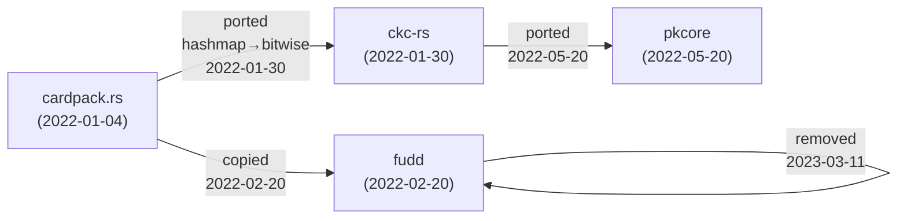

# Huxley: `is_flush`

**Report date:** 2026-09-25

**Repos searched:**
- [pkcore](https://github.com/ImperialBower/pkcore) (HEAD: [`78a45ab1`](https://github.com/ImperialBower/pkcore/commit/78a45ab121e05221ac2ede3d1ea95f4260aa4e2f))
- [cardpack.rs](https://github.com/ImperialBower/cardpack.rs) (HEAD: [`e4c91c57`](https://github.com/ImperialBower/cardpack.rs/commit/e4c91c57a0bd06239ce11a9eaa4e33cb5ce40203))
- [ckc-rs](https://github.com/ImperialBower/ckc-rs) (HEAD: [`8699e1d2`](https://github.com/ImperialBower/ckc-rs/commit/8699e1d2841647654712b2daeff0a80f9b93a494))
- [fudd](https://github.com/ImperialBower/fudd) (HEAD: [`9d20005c`](https://github.com/ImperialBower/fudd/commit/9d20005ccf85a6108a718e6f71e29a6c8a6b5854))

## Summary

`is_flush()` was born in **cardpack.rs** (2022-01-04) as a slow, verification-only hashmap check for 5+ cards of same suit. It was quickly ported to **ckc-rs** (2022-01-30) as a fast bitwise check on fixed arrays — the approach that persists. **pkcore** adopted the ckc-rs design in 2022-05-20 when building `Five` hand evaluation. **fudd** tried a bitvec approach but removed it in 2023. The function is now live in ckc-rs (two forms: standalone + method) and pkcore (method form on `Five`).

## Lineage



## Timeline

| Date | Repo | Commit | What changed |
|------|------|--------|--------------|
| 2022-01-04 | cardpack.rs | [`4514d8b`](https://github.com/ImperialBower/cardpack.rs/commit/4514d8bbcd48193d3185e4034026acb9a1fca9c5) | Born as static method; uses hashmap for verification |
| 2022-01-30 | ckc-rs | [`9ea9052`](https://github.com/ImperialBower/ckc-rs/commit/9ea90526c4503042c5dc30ad2b6b0ab89d506c20) | Ported as standalone function using bitwise AND on array |
| 2022-02-20 | fudd | [`fbaad3c`](https://github.com/ImperialBower/fudd/commit/fbaad3c5afbbef28795ce6e3142ede57a99aaf33) | Copied from cardpack/ckc; method on `BitCards` using `suit_count()` |
| 2022-05-20 | pkcore | [`b107599`](https://github.com/ImperialBower/pkcore/commit/b10759940e00119666c4602f0a87e66a4562d9d1) | **Adopted ckc-rs design:** method on `Five` |
| 2022-05-20 | pkcore | [`193b59f`](https://github.com/ImperialBower/pkcore/commit/193b59f9b00138d4414d402a558a0aec99a4fbee) | Integrated into `Five::rank()` |
| 2022-05-25 | pkcore | [`9e7df76`](https://github.com/ImperialBower/pkcore/commit/9e7df766cf9c58ceb6627d45fd55f93544016821) | Used in `Five::is_straight_flush()` |
| 2023-03-11 | fudd | [`8729355`](https://github.com/ImperialBower/fudd/commit/87293550babe274cf1d2c0d1c0f659a5125a3b48) | Removed when bitvec dropped |
| 2026-07-31 | pkcore | [`b9b5829`](https://github.com/ImperialBower/pkcore/commit/b9b582930ad86b5568397fcbc08da522711da42a) | Profiling: 2.27 ns, not bottleneck |

## Eras

### Era 1: Birth and Divergence (2022-01-04 to 2022-02-20)

**cardpack.rs** first approach — verification-oriented:

[view on GitHub](https://github.com/ImperialBower/cardpack.rs/blob/4514d8bbcd48193d3185e4034026acb9a1fca9c5/src/cards/decks/standard52.rs#L214-L221)

```rust
pub fn is_flush(pile: &Pile) -> bool {
    let hash_map = Standard52::sort_by_suit(pile);
    for c in hash_map.values() {
        if c.len() > 4 {
            return true;
        }
    }
    false
}
```

Non-optimal by design, for validation only. Quickly improved.

**ckc-rs** took the fast path — bitwise AND on fixed arrays:

[view on GitHub](https://github.com/ImperialBower/ckc-rs/blob/9ea90526c4503042c5dc30ad2b6b0ab89d506c20/src/lib.rs#L168-L176)

```rust
pub fn is_flush(five_cards: [PokerCard; 5]) -> bool {
    (five_cards[0]
        & five_cards[1]
        & five_cards[2]
        & five_cards[3]
        & five_cards[4]
        & SUITS_FILTER)
        != 0
}
```

Orders of magnitude faster. This design won.

**fudd** chose a third path — bitvec semantics:

[view on GitHub](https://github.com/ImperialBower/fudd/blob/fbaad3c5afbbef28795ce6e3142ede57a99aaf33/src/types/bitvec/bit_cards.rs#L44-L46)

```rust
pub fn is_flush(&self) -> bool {
    (self.suit_count() == 1) && self.is_complete_hand()
}
```

Cleaner semantics, but carried the bitvec dependency.

### Era 2: Consolidation in pkcore (2022-05-20)

**pkcore** adopted the ckc-rs design with extracted helper:

[view on GitHub](https://github.com/ImperialBower/pkcore/blob/b10759940e00119666c4602f0a87e66a4562d9d1/src/arrays/five.rs#L45-L62)

```rust
#[must_use]
fn and_bits(&self) -> u32 {
    self.first().as_u32()
        & self.second().as_u32()
        & self.third().as_u32()
        & self.forth().as_u32()
        & self.fifth().as_u32()
}

#[must_use]
pub fn is_flush(&self) -> bool {
    (self.and_bits() & Card::SUIT_FLAG_FILTER) != 0
}
```

`and_bits()` extracted as reusable helper, integrated into `rank()` and `is_straight_flush()` same day.

### Era 3: fudd cleanup (2023-03-11)

**fudd** removed `is_flush()` entirely when dropping bitvec. The bitvec-based approach was incompatible with the simpler representation that followed.

### Era 4: Performance measurement (2026-07-31)

**pkcore** profiling showed `is_flush()` at 2.27 ns — fast and not a bottleneck. The real cost was precondition check `is_dealt()` at 98.31 ns (95% of total).

## Today

**Live code:**

- **pkcore** [`src/arrays/five.rs:90-92`](https://github.com/ImperialBower/pkcore/blob/78a45ab121e05221ac2ede3d1ea95f4260aa4e2f/src/arrays/five.rs#L90-L92) — method on `Five`, uses `and_bits() & Card::SUIT_FLAG_FILTER`
- **ckc-rs** [`src/lib.rs:168-176`](https://github.com/ImperialBower/ckc-rs/blob/8699e1d2841647654712b2daeff0a80f9b93a494/src/lib.rs#L168-L176) — standalone function on array `[CKCNumber; 5]`
- **ckc-rs** [`src/cards/five.rs`](https://github.com/ImperialBower/ckc-rs/blob/8699e1d2841647654712b2daeff0a80f9b93a494/src/cards/five.rs) — method on `Five`, mirrors pkcore design

**Dead code:**

- cardpack.rs — removed (no longer in repo)
- fudd — removed 2023-03-11 when bitvec dropped
- pkcore.py, pkcore.js — never ported

## Not searched

- pknotebook, pktui, pkdealer, pkgto-web, pkkuhn-web, pkarena0-web — web/UI repos, assumed to consume the library
- 43 noise commits (file moves, docs, diary, graphify-out build artifacts)
