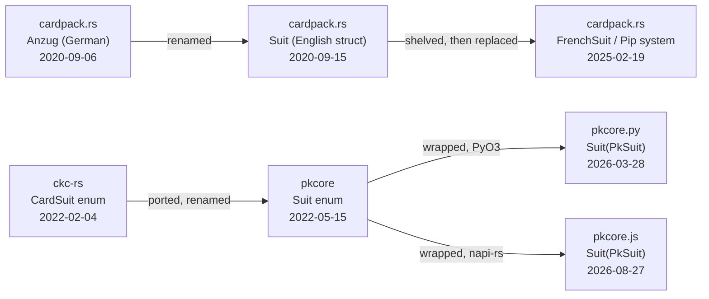

# Huxley: Suit

Report date: 2026-09-27

Repos searched (from `.huxley`), each at its current HEAD:

- [pkcore](https://github.com/ImperialBower/pkcore) @ `6c10b52c`
- [cardpack.rs](https://github.com/ImperialBower/cardpack.rs) @ `e4c91c57`
- [ckc-rs](https://github.com/ImperialBower/ckc-rs) @ `8699e1d2`
- [fudd](https://github.com/ImperialBower/fudd) @ `9d20005c`
- [wincounter](https://github.com/ImperialBower/wincounter) @ `7f88f60e`
- [pkcore.py](https://github.com/ImperialBower/pkcore.py) @ `3723183f`
- [pkcore.js](https://github.com/ImperialBower/pkcore.js) @ `8a7aa05f`
- [pknotebook](https://github.com/ImperialBower/pknotebook) @ `579cfa10`
- [pktui](https://github.com/ImperialBower/pktui) @ `8521ce75`
- [pkdealer](https://github.com/ImperialBower/pkdealer) @ `f7f7cdee`
- [pkgto-web](https://github.com/ImperialBower/pkgto-web) @ `064015e0`
- [pkkuhn-web](https://github.com/ImperialBower/pkkuhn-web) @ `c853b723`
- [pkarena0-web](https://github.com/ImperialBower/pkarena0-web) @ `fbbeb42d`

## Summary

`Suit` was born twice, under two different names, for two different jobs. It first appeared **2020-09-06** in `cardpack.rs` as the German-named `Anzug` (suit) struct — a flexible, internationalized field (name/letter/symbol via Fluent templates) meant to describe *any* card game's suit. Nine days later it was renamed to English (`Anzug`→`Suit`, module `karten`→`deck`). That whole design was later shelved (2025-02-19) and replaced by a generic `Pip`-based system, where suits are now unit structs with associated consts (`FrenchSuit`, `CanastaSuit`, …) — `cardpack.rs` no longer has a type literally named `Suit`. Meanwhile, a sibling repo, `ckc-rs`, independently defined a much simpler `CardSuit` enum in **2022-02-04** for Cactus-Kev-style poker hand evaluation (fixed 4 suits + blank, bit-mask oriented). Three months later, `pkcore` was born carrying that exact shape, renamed `CardSuit`→`Suit` and `Blank`→`BLANK`, with explicit discriminants and a `binary_signature()` method added. That `pkcore::Suit` is the one still alive today, and it has since been wrapped almost verbatim by the Python (`pkcore.py`, 2026-03) and Node (`pkcore.js`, 2026-08) native bindings.

## Lineage



No matching text or comment ties `pkcore`'s `Suit` back to `cardpack.rs`'s — despite the same author working on both — so that edge is not drawn. The `ckc-rs → pkcore` edge is drawn as **ported**: identical derive list (`Clone, Copy, Debug, EnumIter, Eq, Hash, PartialEq`), identical variant set, and only cosmetic renames.

## Timeline

| Date | Repo | Commit | Code | What changed |
|---|---|---|---|---|
| 2020-09-06 | cardpack.rs | [`9d95957`](https://github.com/ImperialBower/cardpack.rs/commit/9d95957ac0dd8fd8f2e650b4173b609d7001487e) | [`karten/anzug.rs:9-27`](https://github.com/ImperialBower/cardpack.rs/blob/9d95957ac0dd8fd8f2e650b4173b609d7001487e/src/karten/anzug.rs#L9-L27) | Birth. `Anzug` struct (German for "suit"): name/letter/symbol, built for i18n via Fluent. An empty placeholder `src/suit.rs` from an earlier commit was deleted in the same PR. |
| 2020-09-15 | cardpack.rs | [`2484d2b`](https://github.com/ImperialBower/cardpack.rs/commit/2484d2b1db7e6f9192a27bbd2659e5b1e6d17a77) | [`deck/suit.rs:9-17`](https://github.com/ImperialBower/cardpack.rs/blob/2484d2b1db7e6f9192a27bbd2659e5b1e6d17a77/src/deck/suit.rs#L9-L17) | "Cleanup" — whole `karten` module renamed to `deck`, `Anzug`→`Suit` (English), fields kept the same shape. |
| 2022-02-04 | ckc-rs | [`c4d6989`](https://github.com/ImperialBower/ckc-rs/commit/c4d6989d3416dbff4dc71a0ac443f3ce8505d2d6) | [`src/lib.rs:125-132`](https://github.com/ImperialBower/ckc-rs/commit/c4d6989d3416dbff4dc71a0ac443f3ce8505d2d6) | Independent birth. `CardSuit` enum for Cactus-Kev-style hand evaluation: `SPADES, HEARTS, DIAMONDS, CLUBS, Blank`, no fields, bit-mask friendly. Unrelated in shape to `cardpack.rs`'s struct. |
| 2022-05-15 | pkcore | [`f004888e`](https://github.com/ImperialBower/pkcore/commit/f004888e1fd777e2d17629f385c366f10ee3fa74) | [`src/suit.rs:3-10`](https://github.com/ImperialBower/pkcore/commit/f004888e1fd777e2d17629f385c366f10ee3fa74) | pkcore's own `Suit` enum appears, matching `ckc-rs`'s `CardSuit` almost line for line: same derive list, `Blank`→`BLANK`, explicit `= 4..0` discriminants added, plus a new `binary_signature()` method. |
| 2025-02-19 | cardpack.rs | [`33495fa`](https://github.com/ImperialBower/cardpack.rs/commit/33495fa63a3a68be9595ff0de6edb8e9671db770) | [`old/suit.rs:28`](https://github.com/ImperialBower/cardpack.rs/commit/33495fa63a3a68be9595ff0de6edb8e9671db770) | "migrated old code to old" — the field-based `Suit` struct moved wholesale into `src/old/`, marking it deprecated. |
| 2025-02-19 | cardpack.rs | [`f8f0bdd`](https://github.com/ImperialBower/cardpack.rs/commit/f8f0bdda836c72c625d6973a1da07970361dfc31) | [`basic/decks/cards/french.rs:5`](https://github.com/ImperialBower/cardpack.rs/commit/f8f0bdda836c72c625d6973a1da07970361dfc31) | "folded in basic" — new `Pip`-based card model lands. `FrenchSuit` is a unit struct with associated `BasicCard` consts (`SPADES`, `HEARTS`, …), replacing the old runtime struct. |
| 2025-02-26 | cardpack.rs | [`2813a56`](https://github.com/ImperialBower/cardpack.rs/commit/2813a5662772e8112f61028e237f25163875fe32) | (deleted; see [old/suit.rs at parent](https://github.com/ImperialBower/cardpack.rs/blob/33495fa63a3a68be9595ff0de6edb8e9671db770/src/old/suit.rs)) | "removed old" — the deprecated `old/suit.rs` is deleted for good. `cardpack.rs` has had no type literally named `Suit` since. |
| 2026-03-28 | pkcore.py | [`fcdbf38`](https://github.com/ImperialBower/pkcore.py/commit/fcdbf380336179be11e9a6fd39e126ac0a1f7e18) | [`src/lib.rs:131-133`](https://github.com/ImperialBower/pkcore.py/commit/fcdbf380336179be11e9a6fd39e126ac0a1f7e18) | PyO3 binding born: `pub struct Suit(PkSuit)` — a thin Python wrapper class around pkcore's `Suit` (aliased `PkSuit` on import), with `#[classattr]` constants mirroring the five variants. |
| 2026-08-27 | pkcore.js | [`dcc1aff`](https://github.com/ImperialBower/pkcore.js/commit/dcc1affce6a8410486a11d78da3ce74f4e765815) | [`src/lib.rs:170-172`](https://github.com/ImperialBower/pkcore.js/commit/dcc1affce6a8410486a11d78da3ce74f4e765815) | napi-rs binding born, EPIC-85: same wrapper shape (`pub struct Suit(PkSuit)`), `#[napi(factory)]` methods instead of `#[classattr]`. |

## Eras

### Era 1 — `Anzug`, a German i18n concern (2020-09-06)

[view on GitHub](https://github.com/ImperialBower/cardpack.rs/blob/9d95957ac0dd8fd8f2e650b4173b609d7001487e/src/karten/anzug.rs#L9-L27)

```rust
#[derive(Clone, Debug, PartialEq)]
pub struct Anzug {
    pub name: AnzugName,
    pub buchstabe: AnzugBuchstabe,
    pub symbol: AnzugSymbol,
}
```

`cardpack.rs` began life with German identifiers throughout (`Karte` = card, `Rang` = rank, `Anzug` = suit), built to demonstrate Fluent-based internationalization from day one — the suit's name, letter, and symbol were each their own localized sub-type.

### Era 2 — Renamed to English, still a runtime struct (2020-09-15)

[view on GitHub](https://github.com/ImperialBower/cardpack.rs/blob/2484d2b1db7e6f9192a27bbd2659e5b1e6d17a77/src/deck/suit.rs#L9-L17)

```rust
#[derive(Clone, Debug, Default, Eq, Ord, PartialEq, PartialOrd)]
pub struct Suit {
    pub value: isize,
    pub name: SuitName,
    pub letter: SuitLetter,
    pub symbol: SuitSymbol,
}
```

Nine days after birth, the whole `karten` module became `deck` and every German type got its English name — this is the only point in the family history where a type literally named `Suit` was a *struct with data* rather than an enum. It stayed roughly this shape for over four years.

### Era 3 — A parallel, poker-specific `CardSuit` is born in ckc-rs (2022-02-04)

[view on GitHub](https://github.com/ImperialBower/ckc-rs/blob/c4d6989d3416dbff4dc71a0ac443f3ce8505d2d6/src/lib.rs#L125-L132)

```rust
#[derive(Clone, Copy, Debug, EnumIter, Eq, Hash, PartialEq)]
pub enum CardSuit {
    SPADES,
    HEARTS,
    DIAMONDS,
    CLUBS,
    Blank,
}
```

`ckc-rs` exists to compute Cactus-Kev hand-rank keys — it needs suits as small, `Copy`-able, bit-mask-friendly values, not as internationalized structs. This has no textual link to `cardpack.rs`'s `Suit`; it is a separate design built for a separate job, three months before `pkcore` existed.

### Era 4 — pkcore's `Suit` is ported from ckc-rs, gains discriminants (2022-05-15)

[view on GitHub](https://github.com/ImperialBower/pkcore/commit/f004888e1fd777e2d17629f385c366f10ee3fa74)

```rust
#[derive(Clone, Copy, Debug, EnumIter, Eq, Hash, PartialEq)]
pub enum Suit {
    SPADES = 4,
    HEARTS = 3,
    DIAMONDS = 2,
    CLUBS = 1,
    BLANK = 0,
}
```

Same derive macro list, same variant order as `ckc-rs::CardSuit`, with two changes: `Blank`→`BLANK` (matching-case convention with the others) and explicit discriminant values, which is what today's `binary_signature()` bit-shifting depends on.

### Era 5 — cardpack.rs shelves and replaces `Suit` with a `Pip`-based model (2025-02-19 to 2025-02-26)

[view on GitHub](https://github.com/ImperialBower/cardpack.rs/blob/f8f0bdda836c72c625d6973a1da07970361dfc31/src/basic/decks/cards/french.rs#L4-L6)

```rust
pub struct FrenchBasicCard;
pub struct FrenchSuit;
pub struct FrenchRank;
```

The old field-based `Suit` struct was moved to `src/old/` and deleted a week later. In its place: unit structs like `FrenchSuit` that carry no data of their own but expose suit values as associated `BasicCard` consts — one design per game (`FrenchSuit`, `CanastaSuit`, etc.) built on a shared `Pip` trait. `cardpack.rs` has had nothing literally named `Suit` since.

### Era 6 — pkcore's `Suit` gets wrapped for Python and JS (2026-03 / 2026-08)

[view on GitHub](https://github.com/ImperialBower/pkcore.py/blob/fcdbf380336179be11e9a6fd39e126ac0a1f7e18/src/lib.rs#L131-L133) · [and JS](https://github.com/ImperialBower/pkcore.js/blob/dcc1affce6a8410486a11d78da3ce74f4e765815/src/lib.rs#L170-L172)

```rust
// pkcore.py
#[pyclass(name = "Suit")]
#[derive(Clone)]
pub struct Suit(PkSuit);

// pkcore.js
#[napi]
#[derive(Clone, Copy)]
pub struct Suit(PkSuit);
```

Both bindings wrap pkcore's `Suit` (imported as `PkSuit`) in a same-named newtype, exposing the five variants as classattrs (Python) or factory functions (JS). Neither reimplements any suit logic — both just forward to pkcore.

## Today

Live code that defines or names something called `Suit`, in each repo:

- **pkcore** — [`src/suit.rs:7-21`](https://github.com/ImperialBower/pkcore/blob/6c10b52c831de0c9ce0d2ea10957ae32b5492c27/src/suit.rs#L7-L21) — the canonical `enum Suit`, unchanged in shape since 2022, now with `# Domain` role docs added.
- **ckc-rs** — [`src/lib.rs:251-258`](https://github.com/ImperialBower/ckc-rs/blob/8699e1d2841647654712b2daeff0a80f9b93a494/src/lib.rs#L251-L258) — `CardSuit`, essentially frozen since birth in 2022; still the pattern pkcore's `Suit` was ported from.
- **pkcore.py** — [`src/lib.rs:223-225`](https://github.com/ImperialBower/pkcore.py/blob/3723183fc1183f9e10d621e8c1446c7b7b6658f4/src/lib.rs#L223-L225) — `pyclass` wrapper `Suit(PkSuit)`.
- **pkcore.js** — [`src/lib.rs:217-219`](https://github.com/ImperialBower/pkcore.js/blob/8a7aa05f7961ee6a4514d54e130eacfb8867f249/src/lib.rs#L217-L219) — `napi` wrapper `Suit(PkSuit)`.
- **cardpack.rs** — no type named `Suit` exists any more. The closest living relative is [`FrenchSuit`](https://github.com/ImperialBower/cardpack.rs/blob/e4c91c57a0bd06239ce11a9eaa4e33cb5ce40203/src/basic/decks/cards/french.rs#L5), a unit struct in the `Pip` system.
- **fudd, wincounter, pknotebook, pktui, pkdealer, pkarena0-web** — only consume `Suit` (import it, e.g. from pkcore or ckc-rs); none define their own.

## Not searched

- **pkgto-web**, **pkkuhn-web** — cloned and scanned, but zero hits for "Suit"/"SPADES" (both are Kuhn-poker-family games without a suited deck).
- **Noise commits skipped**: roughly 25 term hits across `pkcore` and `cardpack.rs` that were doc/comment mentions, file moves, or test-only references, not shape changes to the type itself.
- Scan covered `HEAD` only (not `HUXLEY_ALL=1`); no evidence any relevant `Suit` work is sitting unmerged on another branch.
