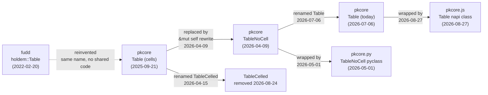

# Huxley: `Table`

**Report date:** 2026-09-25

**Target:** `pkcore::casino::table::Table` — the poker table engine.

**Repos searched:**
- [pkcore](https://github.com/ImperialBower/pkcore) (HEAD: [`78a45ab1`](https://github.com/ImperialBower/pkcore/commit/78a45ab121e05221ac2ede3d1ea95f4260aa4e2f))
- [cardpack.rs](https://github.com/ImperialBower/cardpack.rs) (HEAD: [`e4c91c57`](https://github.com/ImperialBower/cardpack.rs/commit/e4c91c57a0bd06239ce11a9eaa4e33cb5ce40203)) — no hits
- [ckc-rs](https://github.com/ImperialBower/ckc-rs) (HEAD: [`8699e1d2`](https://github.com/ImperialBower/ckc-rs/commit/8699e1d2841647654712b2daeff0a80f9b93a494)) — no hits
- [fudd](https://github.com/ImperialBower/fudd) (HEAD: [`9d20005c`](https://github.com/ImperialBower/fudd/commit/9d20005ccf85a6108a718e6f71e29a6c8a6b5854))
- [wincounter](https://github.com/ImperialBower/wincounter) (HEAD: [`7f88f60e`](https://github.com/ImperialBower/wincounter/commit/7f88f60e3de91066d27a588f0705cee017b83461)) — no hits
- [pkcore.py](https://github.com/ImperialBower/pkcore.py) (HEAD: [`3723183f`](https://github.com/ImperialBower/pkcore.py/commit/3723183fc1183f9e10d621e8c1446c7b7b6658f4))
- [pkcore.js](https://github.com/ImperialBower/pkcore.js) (HEAD: [`8a7aa05f`](https://github.com/ImperialBower/pkcore.js/commit/8a7aa05f7961ee6a4514d54e130eacfb8867f249))
- [pknotebook](https://github.com/ImperialBower/pknotebook) (HEAD: [`579cfa10`](https://github.com/ImperialBower/pknotebook/commit/579cfa10b74ec2b9f527094dbeb876699461b5b9)) — no hits
- [pktui](https://github.com/ImperialBower/pktui) (HEAD: [`8521ce75`](https://github.com/ImperialBower/pktui/commit/8521ce750e4c433b2101de742f0d6c9a67c36021)) — consumer only
- [pkdealer](https://github.com/ImperialBower/pkdealer) (HEAD: [`f7f7cdee`](https://github.com/ImperialBower/pkdealer/commit/f7f7cdee215914a3d5089f0c749c042afb51dbaf)) — consumer only
- [pkgto-web](https://github.com/ImperialBower/pkgto-web) (HEAD: [`064015e0`](https://github.com/ImperialBower/pkgto-web/commit/064015e01560e5bfef176ccfd4f400cc53fdc1cb)) — no hits
- [pkkuhn-web](https://github.com/ImperialBower/pkkuhn-web) (HEAD: [`c853b723`](https://github.com/ImperialBower/pkkuhn-web/commit/c853b723fab3d3abdfd864394cd28b53883032b8)) — no hits
- [pkarena0-web](https://github.com/ImperialBower/pkarena0-web) (HEAD: [`fbbeb42d`](https://github.com/ImperialBower/pkarena0-web/commit/fbbeb42d54c550ab3a3ad633930591652572ca30)) — consumer only

**Terms scanned:** `TableNoCell`, `TableCelled`, `pub struct Table {`, `class Table`, `fn nlh_from_seats`.

## Summary

Today's `Table` is not the first `Table`. It has **two parents**. The first `Table` was born in pkcore on 2025-09-21 as a stub. It grew into an engine built on interior mutability (`Cell`, `RefCell`, `BintCell`, `CardsCell`). On 2026-04-09 a Claude Code session wrote a second engine next to it, `TableNoCell`, with plain fields and `&mut self`. The two engines were forks of each other for four months. Then they swapped names: the old one became `TableCelled` (2026-04-15), and the new one took the name `Table` (2026-07-06). `TableCelled` was deleted on 2026-08-24 (EPIC-83). So the name `Table` survived, but the body under it today comes from `TableNoCell`. pkcore.py and pkcore.js wrap it. pkcore.py still exposes it to Python as `TableNoCell`.

## Lineage



Edge notes:

- **fudd → pkcore** is dashed. The fudd `Table` is a Hold'em analysis struct (`players` + `board`). No line matches pkcore's engine. Same author, same name, different job.
- **Table (cells) → TableNoCell** is "replaced by". The birth commit message says so: "TableNoCell — a parallel Table implementation using &mut self mutability … TableNoCell replaces every wrapper with a plain field."
- **pkcore.py / pkcore.js** are bindings. They hold a `pkcore` `Table` inside a newtype. They do not copy its logic.

## Timeline

| Date | Repo | Commit | Code | What changed |
|---|---|---|---|---|
| 2022-02-20 | fudd | [`fbaad3c`](https://github.com/ImperialBower/fudd/commit/fbaad3c5afbbef28795ce6e3142ede57a99aaf33) | [table.rs#L18-22](https://github.com/ImperialBower/fudd/blob/fbaad3c5afbbef28795ce6e3142ede57a99aaf33/src/games/holdem/table.rs#L18-L22) | An unrelated `Table` (seats + board) in fudd's `init`. |
| 2025-09-21 | pkcore | [`116fa3c2`](https://github.com/ImperialBower/pkcore/commit/116fa3c2baecca0b20d05cda81aec7f1ea020390) | [table.rs#L6-11](https://github.com/ImperialBower/pkcore/blob/116fa3c2baecca0b20d05cda81aec7f1ea020390/src/casino/table.rs#L6-L11) | **Birth.** A 4-field stub: `id`, `game`, `seats`, `dealer`. |
| 2025-10-12 | pkcore | [`fcf70a8f`](https://github.com/ImperialBower/pkcore/commit/fcf70a8fca3f5384c109ad54463753475a81b6cc) | [table.rs#L18-32](https://github.com/ImperialBower/pkcore/blob/fcf70a8fca3f5384c109ad54463753475a81b6cc/src/casino/table.rs#L18-L32) | **Cells arrive.** `RefCell<GamePhase>`, `BintCell`, `CardsCell`, `Stack`. `nlh_from_seats` is born. |
| 2025-11-29 | pkcore | [`bd0fbcfc`](https://github.com/ImperialBower/pkcore/commit/bd0fbcfc3dc825110c88558fe3cce6d7f96fcec1) | [table.rs#L23-41](https://github.com/ImperialBower/pkcore/blob/bd0fbcfc3dc825110c88558fe3cce6d7f96fcec1/src/casino/table.rs#L23-L41) | `nlh_from_seats` removes dealt cards from the deck. Struct gains `forced`, `bet`, `muck`. |
| 2026-04-09 | pkcore | [`aededd65`](https://github.com/ImperialBower/pkcore/commit/aededd65b94b9ff8c7a54c5758c385fdff437b39) | [table_no_cell.rs#L1042-1082](https://github.com/ImperialBower/pkcore/blob/aededd65b94b9ff8c7a54c5758c385fdff437b39/src/casino/table_no_cell.rs#L1042-L1082) | **Second parent born.** `TableNoCell`: 2,650 lines, plain fields, `&mut self`. |
| 2026-04-13 | pkcore | [`158da3d4`](https://github.com/ImperialBower/pkcore/commit/158da3d45016d460cd3c9826650e11b9231c4ffd) | [table_no_cell.rs#L1139-1143](https://github.com/ImperialBower/pkcore/blob/158da3d45016d460cd3c9826650e11b9231c4ffd/src/casino/table_no_cell.rs#L1139-L1143) | Chip audit: `hand_chip_total` field. Now a named invariant on `Table`. |
| 2026-04-15 | pkcore | [`3f1a53a0`](https://github.com/ImperialBower/pkcore/commit/3f1a53a055ee315b3b01b147b1eabf5b04e8c5c4) | [table.rs#L119-139](https://github.com/ImperialBower/pkcore/blob/3f1a53a055ee315b3b01b147b1eabf5b04e8c5c4/src/casino/table.rs#L119-L139) | **First rename.** Old `Table` → `TableCelled`. The name `Table` is free. |
| 2026-04-19 | pkcore | [`076e36d1`](https://github.com/ImperialBower/pkcore/commit/076e36d1f85df11445e0e7c4c9194e647ea0ae98) | — | Short-stack BB call fix, applied to **both** engines. Shows the cost of the fork. |
| 2026-05-01 | pkcore.py | [`3796cfa`](https://github.com/ImperialBower/pkcore.py/commit/3796cfa2d2349680f52098d9f662300315d3f3ef) | [table_no_cell.rs#L173-178](https://github.com/ImperialBower/pkcore.py/blob/3796cfa2d2349680f52098d9f662300315d3f3ef/src/table_no_cell.rs#L173-L178) | Python binding: `#[pyclass(name = "TableNoCell")]`. |
| 2026-07-03 | pkcore | [`6bd6b98a`](https://github.com/ImperialBower/pkcore/commit/6bd6b98a5eb7e517d71d61bf5d092ce50b9f588b) | — | Fable 5 audit fixes: PLO pot cap, Razz bring-in. Only `TableNoCell` gets them. |
| 2026-07-06 | pkcore | [`49f9a6b8`](https://github.com/ImperialBower/pkcore/commit/49f9a6b8b6eabe6d851f23daa2f2a31def29c9d5) | [table.rs#L1236-1298](https://github.com/ImperialBower/pkcore/blob/49f9a6b8b6eabe6d851f23daa2f2a31def29c9d5/src/casino/table.rs#L1236-L1298) | **Second rename.** `TableNoCell` → `Table`. `table_no_cell.rs` moves into `table.rs`; old body moves to `table_celled.rs`. |
| 2026-07-06 | pkcore | [`55d51379`](https://github.com/ImperialBower/pkcore/commit/55d5137914b085d94904403a1e0c90b423dcc65c) | [table.rs#L60-122](https://github.com/ImperialBower/pkcore/blob/55d5137914b085d94904403a1e0c90b423dcc65c/src/casino/table.rs#L60-L122) | Casino reorg: drop `NoCell` suffixes (`SeatsNoCell` → `Seats`), split `table.rs`. Released as 0.2.0. |
| 2026-08-24 | pkcore | [`ba1dd3fc`](https://github.com/ImperialBower/pkcore/commit/ba1dd3fc3f0223c087fee93315f42c9a1754c5ab) | [table_celled.rs#L120-159 (at parent)](https://github.com/ImperialBower/pkcore/blob/cfefea05aca6b33a4794f689394d886e8e070a39/src/casino/table_celled.rs#L120-L159) | **Death of the first parent.** EPIC-83 deletes `TableCelled` (over 5,800 lines). One engine. 0.8.0. |
| 2026-08-25 | pkcore.py | [`7365950`](https://github.com/ImperialBower/pkcore.py/commit/736595020e074f92a9e482f505dfbe8b5159bc50) | — | Python migrates to 0.8.0. The Python name stays `TableNoCell`. |
| 2026-08-27 | pkcore.js | [`974c44d`](https://github.com/ImperialBower/pkcore.js/commit/974c44db363a1fde758f18bc42a2480e1d7d72dd) | [lib.rs#L693-696](https://github.com/ImperialBower/pkcore.js/blob/974c44db363a1fde758f18bc42a2480e1d7d72dd/src/lib.rs#L693-L696) | JS binding: `#[napi] pub struct Table(PkTable)`. JS uses the new name. |

## Eras

### Era 0 — fudd's `Table` (2022, unrelated)

[view on GitHub](https://github.com/ImperialBower/fudd/blob/fbaad3c5afbbef28795ce6e3142ede57a99aaf33/src/games/holdem/table.rs#L18-L22)

```rust
#[derive(Serialize, Deserialize, Clone, Debug, Default)]
pub struct Table {
    pub players: Seats,
    pub board: Board,
}
```

This `Table` holds cards for odds analysis. It has no betting, no pot, no phase. It shares a name and the word `Seats` with pkcore, and nothing else.

### Era 1 — the stub (2025-09-21)

[view on GitHub](https://github.com/ImperialBower/pkcore/blob/116fa3c2baecca0b20d05cda81aec7f1ea020390/src/casino/table.rs#L6-L11)

```rust
pub struct Table {
    pub id: String,
    pub game: GameType,
    pub seats: Vec<seat::Seat>,
    pub dealer: u8,
}
```

Plain fields. No derives. No methods.

### Era 2 — the celled engine (2025-10 to 2026-04)

[view on GitHub](https://github.com/ImperialBower/pkcore/blob/bd0fbcfc3dc825110c88558fe3cce6d7f96fcec1/src/casino/table.rs#L23-L41)

```rust
#[derive(Clone, Debug, Eq, PartialEq)]
pub struct Table {
    pub id: Uuid,
    pub name: String,
    pub game: GameType,
    pub forced: ForcedBets,
    pub phase: RefCell<GamePhase>,
    pub seats: Seats,
    pub button: BintCell,
    pub action_to: BintCell,
    pub deck: CardsCell,
    pub board: CardsCell,
    pub muck: CardsCell,
    pub pot: Stack,
    pub bet: Cell<usize>,
    pub event_log: TableLog,
}
```

Every mutable field sits in a cell. So every method can take `&self` and still change state. This made early game play easy. The cost: a bad borrow panics at run time, not at compile time, and every access goes through a wrapper. The author says so in [DIARY_TableCelled_RIP.md](https://github.com/ImperialBower/pkcore/blob/78a45ab121e05221ac2ede3d1ea95f4260aa4e2f/docs/DIARY_TableCelled_RIP.md?plain=1#L21-L23): "it burries issues. A bad borrow causes a panic … Since everything is coming through cells, it's much slower."

### Era 3 — two engines, side by side (2026-04-09 to 2026-08-24)

[view on GitHub](https://github.com/ImperialBower/pkcore/blob/aededd65b94b9ff8c7a54c5758c385fdff437b39/src/casino/table_no_cell.rs#L1042-L1082)

```rust
#[derive(Clone, Debug)]
pub struct TableNoCell {
    pub id: Uuid,
    pub name: String,
    pub game: GameType,
    pub forced: ForcedBets,
    pub phase: GamePhase,
    pub seats: SeatsNoCell,
    /// Current dealer button position (0-based seat index).
    pub button: u8,
    pub deck: Cards,
    pub board: Cards,
    pub muck: Cards,
    pub pot: usize,
    /// Current highest bet this street.
    pub bet: usize,
    pub raise_increment: usize,
    pub event_log: Vec<TableAction>,
}
```

Same fields, same order. Each cell became a plain type: `BintCell` → `u8`, `CardsCell` → `Cards`, `Stack` → `usize`. This was the author's first big Claude Code task. It quickly became the engine that bots, sessions, pkdealer, pkarena0-web and pktui used. But the old engine stayed. Bug fixes like [`076e36d1`](https://github.com/ImperialBower/pkcore/commit/076e36d1f85df11445e0e7c4c9194e647ea0ae98) had to land twice. Audit fixes like [`6bd6b98a`](https://github.com/ImperialBower/pkcore/commit/6bd6b98a5eb7e517d71d61bf5d092ce50b9f588b) landed only in `TableNoCell`, so the two drifted.

Mid-era, the names swapped in two steps. First [`3f1a53a0`](https://github.com/ImperialBower/pkcore/commit/3f1a53a055ee315b3b01b147b1eabf5b04e8c5c4) renamed the old engine to `TableCelled`. Then [`49f9a6b8`](https://github.com/ImperialBower/pkcore/commit/49f9a6b8b6eabe6d851f23daa2f2a31def29c9d5) gave `Table` to the new engine. Git sees this second step as `table_no_cell.rs` **deleted** and `table.rs` **rewritten**, not as a rename. So `git log --follow src/casino/table.rs` walks back into the *celled* history, not the history of the code that is there now.

### Era 4 — one engine (2026-08-24 to today)

[view on GitHub](https://github.com/ImperialBower/pkcore/blob/78a45ab121e05221ac2ede3d1ea95f4260aa4e2f/src/casino/table.rs#L70-L165)

```rust
/// # Domain
///
/// - **Role:** consistency boundary (DDD: aggregate)
/// - **Invariants:**
///   - chips are conserved across a hand (`audit_chip_total`)
///   - every action in `legal_actions` is accepted by `apply_action`
///   - raise count is capped per street under fixed limit
///   - street counters reset at each street
#[derive(Clone, Debug, Eq, PartialEq)]
pub struct Table {
    pub id: Uuid,
    pub name: String,
    pub game: GameType,
    pub forced: ForcedBets,
    pub phase: GamePhase,
    pub seats: Seats,
    pub button: u8,
    // … deck, board, muck, pot, bet, raise_increment, event_log,
    // hand_chip_total, dealt_hole_cards, betting, raises_this_street, …
}
```

[`ba1dd3fc`](https://github.com/ImperialBower/pkcore/commit/ba1dd3fc3f0223c087fee93315f42c9a1754c5ab) (EPIC-83) removed `TableCelled`. The first 15 fields are still the `TableNoCell` fields from Era 3, in the same order. New fields came from later EPICs: chip audit, betting structures (EPIC-29/30), dealt hole cards. The same commit gave `Table` back `Eq`/`PartialEq`. `TableCelled` had them; `TableNoCell` never did. A code comment in that commit says why: `Nubificus` derives equality through its table.

## Today

| Repo | Where | Form |
|---|---|---|
| pkcore | [src/casino/table.rs:70-165](https://github.com/ImperialBower/pkcore/blob/78a45ab121e05221ac2ede3d1ea95f4260aa4e2f/src/casino/table.rs#L70-L165) | The engine. |
| pkcore.js | [src/lib.rs:725-728](https://github.com/ImperialBower/pkcore.js/blob/8a7aa05f7961ee6a4514d54e130eacfb8867f249/src/lib.rs#L725-L728) | napi wrapper, JS name `Table`. |
| pkcore.py | [src/table_no_cell.rs:173-177](https://github.com/ImperialBower/pkcore.py/blob/3723183fc1183f9e10d621e8c1446c7b7b6658f4/src/table_no_cell.rs#L173-L177) | pyo3 wrapper, Python name still **`TableNoCell`** (imports `pkcore::casino::table::Table as PkTableNoCell`). |

pkdealer, pkarena0-web and pktui use `Table` as consumers. They do not define it.

## Not searched

- **Other branches.** The scan read HEAD only (`HUXLEY_ALL` not set). No unmerged branch hits are listed.
- **External sources.** None named.
- **Noise.** 135 of the 150 scan commits are noise: docs, EPICs, diaries, audits, release notes, dependency bumps in consumer repos, `graphify-out/` build output, and fmt/clippy passes.
